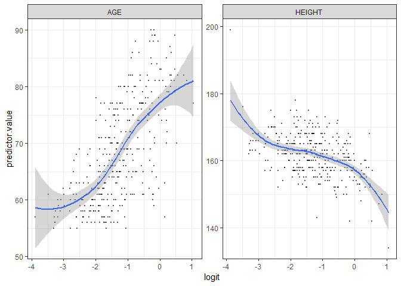
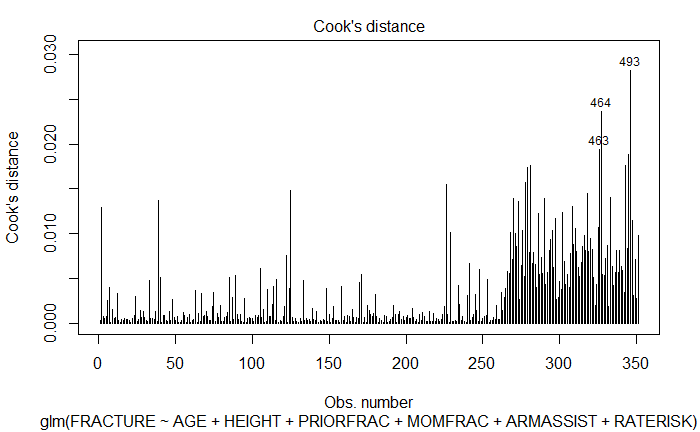
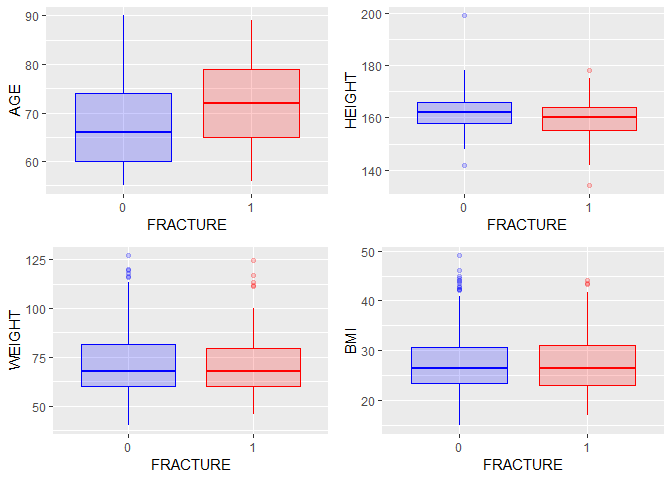
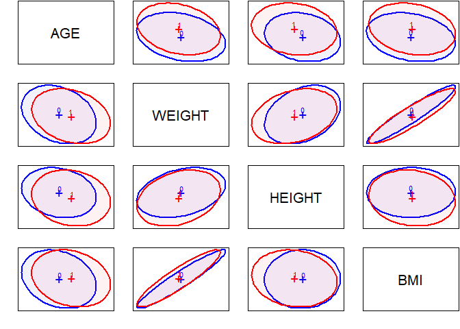
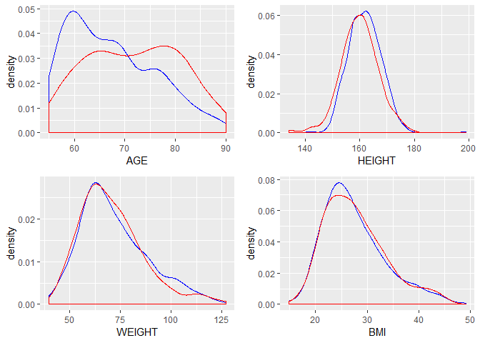

<style type="text/css">

body, td {
   font-size: 16px;
}
code.r{
  font-size: 8px;
}
pre {
  font-size: 10px
}
/* code.r will control the font size for R code echoed from the code chunk, while pre will apply to any R results output from the code. */
</style>

```{r setup00, include=FALSE}
knitr::opts_chunk$set(echo = TRUE)
library(here)
library(knitr)
library(kableExtra)

```
\newpage

## **Objective 1** - EDA and logistic regression model


## Introduction

The Global Longitudinal Study of Osteoporosis in Women (GLOW) (2005-2014) was a prospective cohort study of physician practices in the provision of prophylaxis and treatment against osteoporotic fractures. The goal of this research was to improve understanding of the risk and prevention of osteoporosis-related fractures among female residents of 10 countries who were 55 years of age and older. GLOW enrolled over 60,000 women through over 700 physicians in 10 countries, and conducted annual follow-up for up to 5 years through annual patient questionnaires.

The aim of the GLOW study was to collect uniform data to help describe the distribution of risk factors for osteoporosis-related fracture. This analysis uses one dataset from this study to try to predict a fracture using these risk factors.


## Data Description
<p>The data set provided is about predicting whether a woman with osteoporosis will have another bone fracture.  Of course getting a bone fracture is somewhat circumstantial, but with this disease every day life could trigger a break if the progression of the disease is strong.  

The dataset included a total of 14 variables: 3 ID variables which tell us the subject, doctor and physical location of each record, 4 continuous variables (BMI, Weight, Height, and Age), 6 categorical variables (PRIORFRAC, PREMENO, MOMFRAC, PREMEO, MOMFRAC, ARMASSIST, SMOKE, RATERISK), and the response (FRACTURE). We were unable to find a mapping the subjects with their location to understand the mix of countries represented.

We have 500 subjects in the dataset of which 33% of the subjects have/had fractures. 

Missing values were not detected in dataset. Special characters were removed from column headings.
What we know/don't know about the sample (500)


## Exploratory Analysis  

### Assumptions  
This is a prospective study which means it's a study over time of a group of similar individuals
who differ with respect to certain factors under a study and how these factors affect rates of a certain outcome
(Fracture vs No-Fracture) Linearity - Independence of errors - Based on SUB_ID(Subject ID) we confirm
each record is an independent sample. Multicollinearity - Weight and BMI are highly correlated but we will
remove one from the analysis.


```
GLOW dataset:

Variable Name Type   #Unique  

     SUB_ID  integer  500 - Identification Code (1 - n)  
    SITE_ID  integer    6 - Study Site (1 - 6)  
     PHY_ID  integer  127 - Physician ID code (128 unique codes)  
 PRIORFRAC*   factor    2 - History of Prior Fracture (1: No, 2: Yes)   
        AGE  integer   36 - Age at Enrollment (Years)  
     WEIGHT  numeric  128 - Weight at enrollment (Kilograms)  
     HEIGHT  integer   34 - Height at enrollment (Centimeters)  
        BMI  numeric  409 - Body Mass Index (Kg/m^2)  
   PREMENO*   factor    2 - Menopause before age 45 (1: No, 2: Yes)  
   MOMFRAC*   factor    2 - Mother had hip fracture (1: No, 2: Yes)  
 ARMASSIST*   factor    2 - Arms are needed to stand from a chair (1: No, 2: Yes)  
     SMOKE*   factor    2 - Former or current smoker (1: No, 2: Yes)  
  RATERISK*   factor    3 - Self-reported risk of fracture (1: Less, 2: Same, 3: Greater)    
  FRACSCORE  integer   12 - Fracture Risk Score (Composite Risk Score)  
  FRACTURE*   factor    2 - Any fracture in first year (1: No, 2: Yes)  
  
```
```{r, echo = FALSE, out.width="25%"}
myimages<-list.files("./eda_images/continuous", pattern = ".png", full.names = TRUE)
include_graphics(myimages)
```

#### Figure 1 - Boxplots for Continuous Variables AGE, BMI, HEIGHT, WEIGHT

In Figure 1, we see the boxplots for the continous variables AGE, WEIGHT, HEIGHT, BMI.  

```{r, echo = FALSE, out.width="25%"}
myimages<-list.files("./eda_images/continuous_visual", pattern = ".png", full.names = TRUE)
include_graphics(myimages)
```

#### Figure 2 - Correlation, and Density plots for Continuous Variables AGE, BMI, HEIGHT, WEIGHT

```{r, echo = FALSE, out.width="50%"}
myimages<-list.files("./eda_images/multivariate", pattern = ".png", full.names = TRUE)
include_graphics(myimages)
```

#### Figure 3 - Barplot (occurrances) and Multivariate Plots for Categorical and Continuous Variables 


```{r, echo = FALSE, out.width="50%"}
myimages<-list.files("./eda_images/scatterplots", pattern = ".png", full.names = TRUE)
include_graphics(myimages)
```

#### Figure 4 - Scatterplots 

```{r, echo = FALSE, out.width="25%"}
myimages<-list.files("./eda_images/roc_and_2way", pattern = ".png", full.names = TRUE)
include_graphics(myimages)
```

#### Figure 5 - ROC and 2-way Tables 

```{r, echo = FALSE, out.width="50%"}
myimages<-list.files("./eda_images/clustering", pattern = ".png", full.names = TRUE)
include_graphics(myimages)
```

#### Figure 6 - Clustering  


```{r, echo = FALSE, out.width="50%"}
myimages<-list.files("./model_comparison_images/fracture_counts_cv", pattern = ".png", full.names = TRUE)
include_graphics(myimages)
```

#### Figure 7 - Fracture Counts  


## Restatement of Problem and the overall approach to solve it.

Logistic regression is used to describe data and to explain the relationship between one dependent binary variable, in this case whether a woman will have a fracture related to osteoporosis, with one or more continuous or categorical variables. Using different modeling techniques, we will try to predict whether a sample will have a fracture related event.

## **Simple Logistic Model Selection**


**Model Considerations**

For the purpose of feature selection for the simple logistic model, a lasso+logistic regression with cross validation (for 1000 lambda values) was performed on training data set in order to obtain the penalty value(lambda) that results in minimum misclassification rate. The result of this procedure is present in figure 7 below:

```{r, echo = FALSE, out.width="33%"}
myimages<-list.files("./model_comparison_images/lr_assumptionscheck", pattern = ".png", full.names = TRUE)
include_graphics(myimages)
```

#### Figure 8 - Simple Logistic Regression lasso+logistic regression  

```
Then the lasso+logistic model was rerun with best value of lambda obtained(lambda.min) from previous procedure and was used to uncover feature set that was later used as initial starting point in our simple logistic model. The features selected after LASSO shrinkage procedure are as:
12 x 1 sparse Matrix of class "dgCMatrix"
                                  1
(Intercept)              1.52902669
trainingData.AGE         0.03598544
trainingData.WEIGHT      .         
trainingData.HEIGHT     -0.03340871
trainingData.BMI         .         
trainingData.PRIORFRAC1  0.15180349
trainingData.PREMENO1    .         
trainingData.MOMFRAC1    0.04035537
trainingData.ARMASSIST1  0.52512963
trainingData.SMOKE1      .         
trainingData.RATERISK.L  0.33991586
trainingData.RATERISK.Q  . 
```

Next, we went ahead and run simple logistic regression using this feature set of AGE, HEIGHT, PRIORFRAC, MOMFRAC, ARMASSIST and RATERISK.


**Model Assumptions:**  

**Assumption of binary response while running binary logistic regression.**  

The dependent variable is a factor with two defined levels (0 = No, 1 = Yes).  

**Assumption of independence among observations.**  

Since the method for selecting the subjects for this study and then formulation of given dataset from all of such population is not fully known, caution must be taken while generalizing the results from this analysis. Potential biases could be present among observations as selection bias, recall bias, serial and spatial correlation etc could be present. Generalizing the results from this analysis to whole population of such subjects is to be based upon assumption that subjects in given dataset are as representative of the underlying population as a random samples from such 
population are. For the purpose of our analysis, we assume observations in our dataset are independent of one another and proceed with the analysis.

**Assumption of linearity of independent continuous predictors and their respective log odds**  

A scatter plot between two continuous predictors: AGE and HEIGHT as identified to be used in simple logistic model and their respective log odds is plotted and present as below.

```{r, echo = FALSE, out.width="75%"}

```

#### Figure 9 - Scatter Plot between AGE and HEIGHT and their log odds    

**Simple Logistic Model Fit:**  

The overall logistic regression model using selected variables came out significant and found AGE, HEIGHT, ARMASSIST and RATERISK as significant predictors at alpha=0.05 level for determining probability of getting a fracture in first year(response variable). The model output is as below:  

```
Call:
glm(formula = FRACTURE ~ AGE + HEIGHT + PRIORFRAC + MOMFRAC + 
    ARMASSIST + RATERISK, family = binomial(link = "logit"), 
    data = trainingData)

Deviance Residuals: 
    Min       1Q   Median       3Q      Max  
-1.5491  -0.7377  -0.5763   0.2298   2.2214  

Coefficients:
            Estimate Std. Error z value Pr(>|z|)   
(Intercept)  3.33365    3.80104   0.877  0.38047   
AGE          0.04347    0.01578   2.755  0.00587 **
HEIGHT      -0.04881    0.02165  -2.254  0.02418 * 
PRIORFRAC1   0.22281    0.30097   0.740  0.45912   
MOMFRAC1     0.33522    0.38263   0.876  0.38097   
ARMASSIST1   0.68418    0.27861   2.456  0.01406 * 
RATERISK.L   0.50762    0.24656   2.059  0.03951 * 
RATERISK.Q  -0.06727    0.22219  -0.303  0.76209   
---
Signif. codes:  0 ‘***’ 0.001 ‘**’ 0.01 ‘*’ 0.05 ‘.’ 0.1 ‘ ’ 1

(Dispersion parameter for binomial family taken to be 1)

    Null deviance: 395.31  on 350  degrees of freedom
Residual deviance: 355.55  on 343  degrees of freedom
AIC: 371.55
```
A recursive model refinement process was performed by trying to add more variables that were not present in initial fit; and model performance in terms of AUC under ROC curve and accuracy via confusion matrix for validation dataset was assessed for each subsequent model. No subsequent model fit resulted in significant gains in terms of improved performance parameters. In fact, some resulted in decrease in accuracy on validation set as they were just acting as noise and didn’t provide any valuable information about the response variable. Hence, initial fit was chosen as best fit and assessed further.   

On the initial model fit, VIFs and influential observation analysis was then performed and results can be seen below as:

```{r, echo = FALSE, out.width="75%"}

```

#### Figure 10 - Logistic Regression - Cook's D    

```

              GVIF Df GVIF^(1/(2*Df))
AGE       1.209972  1        1.099987
HEIGHT    1.084342  1        1.041317
PRIORFRAC 1.172110  1        1.082640
MOMFRAC   1.010590  1        1.005281
ARMASSIST 1.124261  1        1.060312
RATERISK  1.096380  2        1.023270

```

As seen from above results that multiclonality is not seen and no substantially influential observation is found as seen from Cook’s d plot. Hence, we proceeded with current model for model equation formulation and coefficients interpretations.


**Model Equation**

$log(\pi)$ = 3.33365 +  0.04347 * AGE - 0.04881 * HEIGHT + 0.22281 * PRIORFRAC + 0.33522 * MOMFRAC    
                + 0.68418 * ARMASSIST + 0.50762 * RATERISK_2 - 0.06727 * RATERISK_3    

```
Next, we converted model coefficients and their respective 95% Confidence Intervals to Normal Scale and proceeded with coefficient interpretations as below:  

            ODDs_Ratio     2.5 %       97.5 %
(Intercept) 28.0403767 0.0172620 5.378401e+04
AGE          1.0444253 1.0128322 1.077662e+00
HEIGHT       0.9523628 0.9118527 9.929059e-01
PRIORFRAC1   1.2495774 0.6857875 2.237992e+00
MOMFRAC1     1.3982464 0.6449924 2.917750e+00
ARMASSIST1   1.9821443 1.1469582 3.428352e+00
RATERISK.L   1.6613370 1.0283916 2.713240e+00
RATERISK.Q   0.9349462 0.6060378 1.451499e+00

```


## *Interpretation of the Coefficients:*  


For AGE: All the other variables being constant, for every one-year increase in age of women, the odds of being getting a fracture in first year (versus not getting a fracture in first year) increases by a factor of 1.04(4% increase). The 95% Confidence Interval for this multiplicative factor is from 1.01(1% increase) to 1.08(8% increase).  

For HEIGHT: All the other variables being constant, for every one unit increase in height of women, the odds of being getting a fracture in first year (versus not getting a fracture in first year) decreases by a factor of 0.95(5% decrease). The 95% Confidence Interval for this multiplicative factor is from 0.91(9% decrease) to 0.99(1% decrease).  

** All the below coefficients are of format:
The estimated odds for Person X with/without characteristic are M times the odds (of developing fracture in first year), for another Person Y without/with that characteristic. **  

For PRIORFRAC: All the other variables being constant, the estimated odds for a woman, who has history of prior fracture, are 1.25 (25% more) times the odds of having fracture again in first year, for a woman who didn’t have prior history of fracture. The 95% Confidence Interval for this estimated odds ratio is from 0.69 times to 2.23 times.

For MOMFRAC: All the other variables being constant, the estimated odds for a woman, whose mother had hip fracture, are 1.40 (40% more) times the odds of having fracture in first year, for a woman whose mother didn’t have hip fracture. The 95% Confidence Interval for this estimated odds ratio is from 0.64 times to 2.91 times.

For ARMASSIST: All the other variables being constant, the estimated odds for a woman, who needed arms to stand from a chair, are 1.98 (98% more) times the odds of having fracture in first year, for a woman who didn’t need arms to stand from a chair. The 95% Confidence Interval for this estimated odds ratio is from 1.15 times to 3.43 times.

For RATERISK.2: All the other variables being constant, the estimated odds for a woman, who self-reported that her risk for developing fracture is same as others of the same age, are 1.66 (66% more) times the odds of having fracture in first year, for a woman who self-reported that her risk for developing fracture is less than others of the same age. The 95% Confidence Interval for this estimated odds ratio is from 1.03 times to 2.71 times.

For RATERISK.3: All the other variables being constant, the estimated odds for a woman, who self-reported that her risk for developing fracture is greater than others of the same age, are 0.93 (7% less) times the odds of having fracture in first year, for a woman who self-reported that her risk for developing fracture is less than others of the same age. The 95% Confidence Interval for this estimated odds ratio is from 0.61 times to 1.45 times.


**Model Assessment:**  

Model performance was assessed on validation data using following parameters:  

1.	AUC under ROC curve  
2.	Overall Accuracy, Sensitivity and Specificity values obtained from confusion matrix.  


```{r, echo = FALSE, out.width="50%"}
pics<-c("./model_comparison_images/lr_normal/logisticRegressionNormal-1.png", "./model_comparison_images/lr_normal/logisticRegressionNormal-2.png")

include_graphics(pics)
```

#### Figure 10 - Simple Logistic Regression - Performance    

```
## Confusion Matrix and Statistics
##
## Reference
## Prediction 0 1
## 0 108 35
## 1 4 2
##
## Accuracy : 0.7383
## 95% CI : (0.66, 0.8068)
## No Information Rate : 0.7517
## P-Value [Acc > NIR] : 0.6866
##
## Kappa : 0.0255
## Mcnemar's Test P-Value : 1.556e-06
##
## Sensitivity : 0.96429
## Specificity : 0.05405
## Pos Pred Value : 0.75524
## Neg Pred Value : 0.33333
## Prevalence : 0.75168
## Detection Rate : 0.72483
## Detection Prevalence : 0.95973
## Balanced Accuracy : 0.50917
##
## 'Positive' Class : 0
##
```

#### Figure 11 - Simple Logistic Regression - Confusion Matrix    


As seen from above ROC curves and confusion matrix:

1.	Training set AUC is 71.6% and that for validation data set is about 67.7%. This is understandable since model was created using data training data set.  

2.	Overall Accuracy of the model is at 74.5% with high sensitivity 94.64% but very low specificity 13.51 %.   

3.	There relative low values of overall AUC and accuracy could be due to:  
    a.	Lack of complexity in the current model (in terms of higher order terms, transformations, interactions) etc.  
    b.	The available feature set and number of samples available are not sufficient enough to accurate model most of the trends in actual population data.  
    c.	Class imbalance that is present in original, training and validation data set. Especially, the number of true positive cases are very much under represented in both the training and test datasets and this could be the cause of low specificity values obtained from this model.  
    
4.	 Specificity for the model could be improved by lower the cutoff for classification from its initial value of 0.5. This should be warranted since cost of not predicting true positive outweighs cost of predicting false positive in the current situation.  


## Final conclusions from the analysis of Objective 1

To improve the accuracy and AUC for the model, we would next increase complexity in current model by adding interactions to it.


\newpage

## **Objective 2** - Additional Competing Models

•	The performance of the Simple Logistic Regression model developed earlier has performance characteristics described in Figure X and Figure X with the AUC under ROC curve and Confusion Matrix.  

## **Logistic Regression Model with Interactions**  

**Model Considerations:**  

Since simple model was lacking in terms of complexity, hence interaction terms were added to the initial simple model in the hope of improving its predictive capability. After the recursive EDA process, three potential interactions were found from the dataset: AGE * PRIORFRAC, MOMFRAC * ARMASSIST and AGE * RATERISK. These could improve model performance as seen from below graphs that distribution for AGE variable among PRIOR FRAC groups is different for FRACTURE and NON-FRACTURE group and same is observed for MOMFRAC and ARMASSIST for levels of FRACTURE group as seen below:


```{r, echo = FALSE, out.width="50%"}
myimages<-list.files("./model_comparison_images/plotting_interactions", pattern = ".png", full.names = TRUE)
include_graphics(myimages)
```

#### Figure 12 - Logistic Regression - Interactions  


**Model Assumptions:**  

Model assumptions are satisfied as we have seen from assumption section in simple logistic model section. 


**Model Fit:**  

The overall logistic regression model using selected variables and interactions came out significant. But, since interactions were added, multicollinearity is created and VIF for the model increased as seen below:

```
                         GVIF Df GVIF^(1/(2*Df))
AGE                  1.997142  1        1.413203
HEIGHT               1.102446  1        1.049975
PRIORFRAC           67.052577  1        8.188564
MOMFRAC              1.872604  1        1.368431
ARMASSIST            1.292878  1        1.137048
RATERISK          4440.469420  2        8.163140
AGE:PRIORFRAC       71.017561  1        8.427192
AGE:RATERISK      4423.340582  2        8.155256
MOMFRAC:ARMASSIST    2.037634  1        1.427457

```

This issue was dealt by centering the AGE variable and re-running the model. The VIFs came back to normal values after centering on AGE variable was performed as seen below from VIFs after centering:  

```
AGE               1.997142  1        1.413203
HEIGHT            1.102446  1        1.049975
PRIORFRAC         1.293722  1        1.137419
MOMFRAC           1.872604  1        1.368431
ARMASSIST         1.292878  1        1.137048
RATERISK          1.354533  2        1.078816
AGE:PRIORFRAC     2.076106  1        1.440870
AGE:RATERISK      1.295266  2        1.066816
MOMFRAC:ARMASSIST 2.037634  1        1.427457

```
The model output is as below:  

```
glm(formula = FRACTURE ~ AGE + HEIGHT + PRIORFRAC + MOMFRAC + 
    ARMASSIST + RATERISK + AGE:PRIORFRAC + RATERISK:AGE + MOMFRAC:ARMASSIST, 

    family = binomial(link = "logit"), data = trainingData)

Deviance Residuals: 
    Min       1Q   Median       3Q      Max  
-1.5521  -0.7592  -0.5543   0.2845   2.3802  

Coefficients:
                    Estimate Std. Error z value Pr(>|z|)   
(Intercept)          6.25924    3.51520   1.781  0.07497 . 
AGE                  0.60346    0.18440   3.273  0.00107 **
HEIGHT              -0.04913    0.02191  -2.242  0.02495 * 
PRIORFRAC1           0.38979    0.31394   1.242  0.21438   
MOMFRAC1             0.74167    0.50795   1.460  0.14426   
ARMASSIST1           0.80585    0.29990   2.687  0.00721 **
RATERISK.L           0.58312    0.26591   2.193  0.02831 * 
RATERISK.Q          -0.13762    0.23352  -0.589  0.55566   
AGE:PRIORFRAC1      -0.45140    0.27996  -1.612  0.10688   
AGE:RATERISK.L      -0.13870    0.24978  -0.555  0.57869   
AGE:RATERISK.Q       0.14622    0.22380   0.653  0.51355   
MOMFRAC1:ARMASSIST1 -0.74229    0.76220  -0.974  0.33011   
---
Signif. codes:  0 ‘***’ 0.001 ‘**’ 0.01 ‘*’ 0.05 ‘.’ 0.1 ‘ ’ 1

(Dispersion parameter for binomial family taken to be 1)

```
Although no interaction was significant at alpha=0.05 level, interaction between AGE*PriorFrac looks promising (p-value = 0.10688). Hence, using the above model for model equation formulation.

**Model Equation:**  

**Model Assessment.**  

Model performance was assessed on validation data using following parameters:  

1.	AUC under ROC curve  

2.	Overall Accuracy, Sensitivity and Specificity values obtained from confusion matrix.  


```{r, echo = FALSE, out.width="50%"}
pics<-c("./model_comparison_images/lr_normal/logisticRegressionNormal1-1.png", "./model_comparison_images/lr_normal/logisticRegressionNormal1-2.png")

include_graphics(pics)
```

#### Figure 13 - Logistic Regression with Interactions - Performance    

```
## Confusion Matrix and Statistics
##
## Reference
## Prediction 0 1
## 0 105 30
## 1 7 7
##
## Accuracy : 0.7517
## 95% CI : (0.6743, 0.8187)
## No Information Rate : 0.7517
## P-Value [Acc > NIR] : 0.5440183
##
## Kappa : 0.16
## Mcnemar's Test P-Value : 0.0002983
##
## Sensitivity : 0.9375
## Specificity : 0.1892
## Pos Pred Value : 0.7778
## Neg Pred Value : 0.5000
## Prevalence : 0.7517
## Detection Rate : 0.7047
## Detection Prevalence : 0.9060
## Balanced Accuracy : 0.5633
##
## 'Positive' Class : 0
##
```
#### Figure 14 - Logistic Regression with Interactions - Confusion Matrix    


As seen from above ROC curves and confusion matrix:  
1.	Training set AUC is 72.5% and that for validation data set is about 72.2%. This is understandable since model was created using data training data set.  
2.	Overall Accuracy of the model is at 75.17% with high sensitivity 93.75% but low specificity 18.92 %.  
3.	This model performed little better over simple model with AUC increasing from 67.7% to 72.2% and overall accuracy increasing from 74.5% to 75.17%.   
4.	These slight increases in accuracy are consistent with the outcome received from model fit that none of the interactions added were highly significant. So, added complexity did increase the overall AUC by about 5 % but was not improved performance significantly.  
5.	There relative low values of overall AUC and accuracy could be due to:  
  a.	Still Missing complexity in the current model (in terms of higher order terms, transformations, further interactions) etc.
  b.	The available feature set and number of samples available are not sufficient enough to accurate model most of the trends in actual population data.  
  c.	Class imbalance that is present in original, training and validation data set. Especially, the number of true positive cases are very much underrepresented in both the training and test datasets and this could be the cause of low specificity values obtained from this model.  
6.	 Specificity for the model could be improved by lower the cutoff for classification from its initial value of 0.5. This should be warranted since cost of not predicting true positive outweighs cost of predicting false positive in the current situation.  


## **Random Forest and Conditional Random Forest Models**  

**Model Considerations.**  

To further account for the remaining complexity and improve model predictive ability, we ran the ensemble based random forest model. We ran both flavors of random forest model that is normal one and conditional random forest one. Normal random forest model is biased towards predictors with more levels since knowing these would decrease the entropy the most and provide more information. Hence, normal random forest favors predictors with more levels. Whereas, conditional random forest takes this into account and produce more unbiased trees than normal random forest by assigning more weights to certain nodes at the time of aggregation.  

A recursive process was performed to tune the random forest model for ntee, mtry and maxnodes parameters. Without pruning the tree length, random forest overfitted on our relatively small training data set but performed poorly as compared to logistic regression on validation data set as seen below:


```{r, echo = FALSE, out.width="50%"}
pics<-c("./model_comparison_images/random_forests2/rf_train.png", "./model_comparison_images/random_forests2/rf_test.png")

include_graphics(pics)
```

#### Figure 15 - Random Forests - Performance    

Maxnodes parameter along with ntree and mtry parameters was adjusted so as to achieve better performance and then we proceeded with fitting the random forest model.  

**Model Assumptions:**  

Since random forest is a non-parametric test which relies upon ensemble techniques, it doesn’t require model assumptions to be satisfied before running the model.  


**Model Fit.**  

```
Call:
 randomForest(formula = FRACTURE ~ ., data = trainingData, mtry = 4,      ntree = 500, maxnodes = 12, importance = T) 
               Type of random forest: classification
                     Number of trees: 500
No. of variables tried at each split: 4

        OOB estimate of  error rate: 24.79%
Confusion matrix:
    0 1 class.error
0 260 3  0.01140684
1  84 4  0.95454545

```

```{r, echo = FALSE, out.width="50%"}
pics<-c("./model_comparison_images/random_forests/runningRandomForest-3.png")

include_graphics(pics)
```

#### Figure 16 - Random Forest   

As predicted, random forest is assigning more importance to predictors with more levels. 

**Model Assessment:**  


```{r, echo = FALSE, out.width="50%"}
pics<-c("./model_comparison_images/random_forests/runningRandomForest-1.png", "./model_comparison_images/random_forests/runningRandomForest-2.png")

include_graphics(pics)
```

#### Figure 17 - Conditional Random Forests   

```
Confusion Matrix and Statistics

          Reference
Prediction   0   1
         0 111  37
         1   1   0
                                          
               Accuracy : 0.745           
                 95% CI : (0.6672, 0.8128)
    No Information Rate : 0.7517          
    P-Value [Acc > NIR] : 0.6175          
                                          
                  Kappa : -0.0132         
 Mcnemar's Test P-Value : 1.365e-08       
                                          
            Sensitivity : 0.9911          
            Specificity : 0.0000          
         Pos Pred Value : 0.7500          
         Neg Pred Value : 0.0000          
             Prevalence : 0.7517          
         Detection Rate : 0.7450          
   Detection Prevalence : 0.9933          
      Balanced Accuracy : 0.4955          

```
#### Figure 18 - Conditional Random Forest Confusion Matrix   


  As seen from above ROC curves and confusion matrix:
1.	Random Forest model improves on overall AUC performance slightly and takes it to 74.2% as compared to logistic regression with interaction model that had 72.5% AUC. So it did model some extra remaining complexity.  

2.	This model performed really badly as compared to other models in classifying true positives and have specificity value of zero.  

3.	This could be due to the fact that our training and test datasets have slight proportion of positive cases and model is unable to capture trends in positive observations as accurately as it captured for negative observations. Small sample sizes in training and validation sets and class unbalance is appearing to contribute to this discrepancy, since random forest model is prone to overfitting when sample sizes are relatively small.    
4.	Conditional random forest model performed better than this model in terms of overall accuracy and specificity values as seen from below results but it suffered on overall AUC. But again, this could be caused due to random variation and biases in data sets.  

```{r, echo = FALSE, out.width="50%"}
myimages<-list.files("./model_comparison_images/conditional_random_forests", pattern = ".png", full.names = TRUE)
include_graphics(myimages)
```


#### Figure 19 - Conditional Random Forest using Conditional Inference Trees   

```
	 Random Forest using Conditional Inference Trees

Number of trees:  500 

Response:  FRACTURE 
Inputs:  PRIORFRAC, AGE, WEIGHT, HEIGHT, BMI, PREMENO, MOMFRAC, ARMASSIST, SMOKE, RATERISK 
Number of observations:  351 

Confusion Matrix and Statistics

          Reference
Prediction   0   1
         0 106  31
         1   6   6
                                          
               Accuracy : 0.7517          
                 95% CI : (0.6743, 0.8187)
    No Information Rate : 0.7517          
    P-Value [Acc > NIR] : 0.544           
                                          
                  Kappa : 0.1403          
 Mcnemar's Test P-Value : 7.961e-05       
                                          
            Sensitivity : 0.9464          
            Specificity : 0.1622 
         
Variable Importance as predicted by conditional random forest

AGE        HEIGHT     ARMASSIST           BMI     PRIORFRAC        WEIGHT      RATERISK         SMOKE       PREMENO       MOMFRAC


```


## **Linear Discriminant Analysis Model**  

**Model Considerations.**  

LDA can only be done with continuous predictors and in our dataset we have only four continuous predictors: AGE, HEIGHT, WEIGHT and BMI. As we have seen in EDA part that categorical variables appear to be significant in classifying the response, throwing away the information they provide could result in decrease in overall performance of the model (and BMI and WEIGHT not been so significant as seen from logistic model) as compared to rest of the models.  

**Model Assumptions:**  

**Assumption of Equal Variance / CoVariance.**  

We computed the amount of the between-group variance that is explained by each linear discriminate. In this dataset, we tested whether the variance in each continuous variable is the same for all subjects with/without Fractures.  


```{r, echo = FALSE, out.width="75%"}

```

#### Figure 20 - LDA Equal Variance   

```
Levene's Test for Homogeneity of Variance (center = median)
       Df F value Pr(>F)
group   1   1.522 0.2179
      498               
Levene's Test for Homogeneity of Variance (center = median)
       Df F value Pr(>F)
group   1  0.9566 0.3285
      498               
Levene's Test for Homogeneity of Variance (center = median)
       Df F value Pr(>F)
group   1  0.9475 0.3308
      498               
Levene's Test for Homogeneity of Variance (center = median)
       Df F value Pr(>F)
group   1  0.0188 0.8911


```

```{r, echo = FALSE, out.width="75%"}

```

#### Figure 21 - LDA Ellipse Plots   

From the boxplots and ellipse plots above we can didn’t observe difference in spread of eclipses and axis of eclipses are fairly aligned for each pair. We also ran a Levene’s Test between each predictor and response and result confirms that spread for each predictor is not differing for levels of response  

**Assumption of independence among observations.**  

Since the method for selecting the subjects for this study and then formulation of given dataset from all of such population is not fully known, caution must be taken while generalizing the results from this analysis. Potential biases could be present among observations as selection bias, recall bias, serial and spatial correlation etc could be present. Generalizing the results from this analysis to whole population of such subjects is to be based upon assumption that subjects in given dataset are as representative of the underlying population as a random samples from such population are. For the purpose of our analysis, we assume observations in our dataset are independent of one another and proceed with the analysis.  

**Assumption of Normality**  

Density plots were plotted for each predictor for both levels of response as seen below:  

```{r, echo = FALSE, out.width="75%"}

```

#### Figure 22 - LDA Density Plots   


Distribution of all predictors except AGE looks sufficiently normal and have about similar spread. To check on AGE variable a QQ Plot for AGE for both levels of response variable was plotted as seen below:  

```{r, echo = FALSE, out.width="50%"}
pics<-c("./model_comparison_images/LDA/runningLDA-4.png", "./model_comparison_images/LDA/runningLDA-5.png")
include_graphics(pics)
```

#### Figure 23 - LDA QQ Plots   


As seen from the above QQ plots and presence of sufficient sample size, distribution of AGE looks sufficiently Normal for both levels of response variable.

Since all the assumptions for LDA have been met, we would now go ahead and run the LDA model.

**Model Fit.**

```
Call:
lda(FRACTURE ~ AGE + HEIGHT + WEIGHT + BMI, data=trainingData)

Prior probabilities of groups:
        0         1
        0.7492877 0.2507123
        
Group means:
       AGE    HEIGHT   WEIGHT     BMI
0 67.16730 162.2129 72.01559 27.31879  
1 71.95445 159.7614 70.53409 27.69421

Coefficients of linear discriminants:
               LD1
AGE     0.08790497
HEIGHT  0.20784982
WEIGHT -0.31576637
BMI     0.86125425
```

**Model Assessment.**

Model performance was assessed on training data using following parameters:  
1.	AUC under ROC curve  
2.	Overall Accuracy, Sensitivity and Specificity values obtained from confusion matrix.  

**ROC Curve for Training  **  

```{r, echo = FALSE, out.width="50%"}
pics<-c("./model_comparison_images/LDA/lda01.png", "./model_comparison_images/LDA/lda02.png")
include_graphics(pics)
```

#### Figure 24 - LDA ROC Plots   


```{r, echo = FALSE, out.width="50%"}
pics<-c("./model_comparison_images/LDA/lda03.png")
include_graphics(pics)
```

#### Figure 25 - LDA Confusion Matrix     

As seen from above ROC curves and confusion matrix:  
1.	Training set AUC is 67% and that for validation data set is about 60.2%. This is understandable since model was created using data training data set.  
2.	Overall Accuracy of the model is at 73.15% with high sensitivity 94.64% but very low specificity 8.1 %.   
3.	There relative low values of overall AUC and accuracy could be due to:  
a.	Lack of complexity in the current model (in terms of higher order terms, transformations, interactions) etc.  
b.	The fact tha LDA only asseses continuous variables.  
c.	Class imbalance that is present in original, training and validation data set. Especially, the number of true positive cases are very much under represented in both the training and test datasets and this could be the cause of low specificity values obtained from this model.  
4.	 Specificity for the model could be improved by lower the cutoff for classification from its initial value of 0.5. This should be warranted since cost of not predicting true positive outweighs cost of predicting false positive in the current situation.  

To improve the accuracy and AUC for the model, we would need increase the number of continuous variables to explain the dataset.  


**Note on PCA**  

Our dataset had only 4 continuous predictors so PCA would not help us much in terms of dimensionality reduction. We ran initial PCA model to see if data separates out well. But as seen from below output from Scree plot that 4 Principal Components were required to explain all variance and that’s equal to number of predictors used. Also, data didn’t separate out well between PC1 and PC2.

```{r, echo = FALSE, out.width="50%"}
pics<-c("./model_comparison_images/LDA/pcs_scree.png", "./model_comparison_images/LDA/pca_glow500.png")
include_graphics(pics)
```

#### Figure 26 - LDA PCA Notes   


```

## Summary table of performance

| Model                                                         | Predictors         | Accuracy | 95% CI         | Sensitivity | Specificity | AUC   |
|---------------------------------------------------------------|--------------------|----------|----------------|-------------|-------------|-------|
| Logistic Regression (logit)                                   | 7                  | 74.5%    | (66.7%, 81.3%) | 94.6%       | 13.5%       | 67.8% |
| Logistic Regression w/Interactions (logit)                    | 7 + 3 interactions | 75.2%    | (67.4%, 81.9%) | 92.9%       | 21.6%       | 72.2% |
| Random Forest*                                                | 10                 | 74.5%    | (66.7%, 81.3%) | 99.1%       | 0.0%        | 74.2% |
| *RF Lower Cutoff (decreasing the probability from 50% to 30%) | 10                 | 73.8%    | (66%, 80.7%)   | 91.1%       | 21.6%       |       |
| Conditional Random Forest                                     | 10                 | 75.2%    | (67.4%, 81.9%) | 94.6%       | 16.2%       | 69.3% |
| LDA                                                           | 4                  | 73.2%    | (65.3%, 80.1%) | 94.6%       | 8.1%        | 60.2% |


## Conclusion/Discussion

In summary, as seen from above table with performance metrices:  

Simple logistic model suffers in terms of prediction accuracy since its not complex enough to model all trends present in dataset. Logistic regression model with interactions added did a better job in improving the overall AUC and accuracy over the simple logistic model. Random Forest increased the overall AUC but performed really badly in terms of specificity and looks to overfit the trends in dataset on true negative side and hence predicting badly on true positive side since our training/validation dataset was unbalanced in favor of true negative observations. LDA, as expected performed poorly as compared to other models in terms of overall AUC since it didn’t consider categorical variables and it can be seen from EDA that most of categorical variables looked promising for separating the response. And also, two of continuous predictors: Weight and BMI were not significant as seen by the logistic model fit. Hence, all in all, in our given dataset, we think logistic model with interactions performed better than rest of the models since it didn’t overfit on true negative side and had enough complexity as compared to rest of the models to make informed predictions.   


## ***Appendix*** ==========================================  


## *** ***Appendix A:*** EDA - Analysis =======================  


```{r child = 'EDA.Rmd'}
```


## *** ***Appendix B:*** Model Comparison - Analysis ==========  


```{r child = 'ModelComparison.Rmd'}
```


## *** ***Appendix C:*** Test interaction - LDA ===============  


```{r child = 'test_interaction.Rmd'}
```

