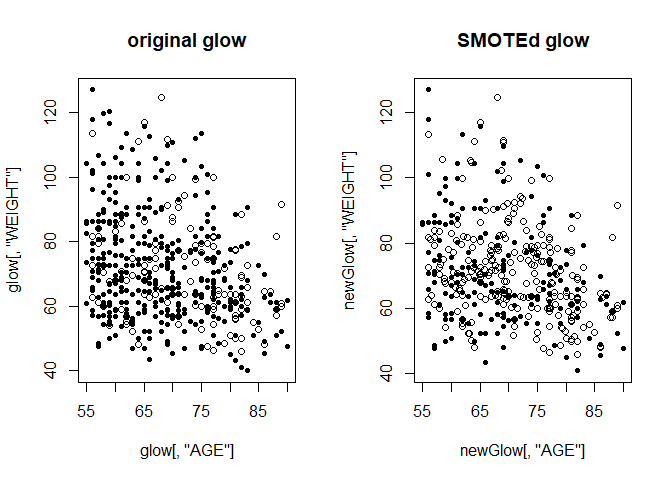

## Use SmartEDA for some basic EDA, then use SMOTE to create balanced data


```r
library(here)
```

```
## here() starts at D:/2018-stats2-project/stats2proj2
```

```r
library(knitr)
library(kableExtra)

glow_data_file <- here("data", "glow500.csv")
glow <- read.csv(glow_data_file)

#summary(glow)

glow$PRIORFRAC <- factor(glow$PRIORFRAC, levels=c(0,1), labels=c("No","Yes"))
glow$PREMENO <- factor(glow$PREMENO, levels=c(0,1), labels=c("No","Yes"))
glow$MOMFRAC <- factor(glow$MOMFRAC, levels=c(0,1), labels=c("No","Yes"))
glow$ARMASSIST <- factor(glow$ARMASSIST, levels=c(0,1), labels=c("No","Yes"))
glow$SMOKE <- factor(glow$SMOKE, levels=c(0,1), labels=c("No","Yes"))
glow$RATERISK <- factor(glow$RATERISK, levels=c(1,2,3), labels=c("Less","Same","Greater"))
glow$FRACTURE <- factor(glow$FRACTURE, levels=c(0,1), labels=c("No","Yes"))

#summary(glow)
```


```r
library("ISLR")
library("SmartEDA")

# structure of data - Type = 1
ExpData(data=glow,type=1)
```

```
##                                 Descriptions       Obs
## 1                         Sample size (Nrow)       500
## 2                    No. of Variables (Ncol)        15
## 3                   No. of Numeric Variables         8
## 4                    No. of Factor Variables         7
## 5                      No. of Text Variables         0
## 6                   No. of Logical Variables         0
## 7                      No. of Date Variables         0
## 8   No. of Zero variance Variables (Uniform)         0
## 9      %. of Variables having complete cases 100% (15)
## 10 %. of Variables having <50% missing cases    0% (0)
## 11 %. of Variables having >50% missing cases    0% (0)
## 12 %. of Variables having >90% missing cases    0% (0)
```

```r
# structure of data - Type = 2
ExpData(data=glow,type=2)
```

```
##    S.no Variable Name Variable Type % of Missing No. of Unique values
## 1     1        SUB_ID       integer            0                  500
## 2     2       SITE_ID       integer            0                    6
## 3     3        PHY_ID       integer            0                  127
## 4     4    PRIORFRAC*        factor            0                    2
## 5     5           AGE       integer            0                   36
## 6     6        WEIGHT       numeric            0                  128
## 7     7        HEIGHT       integer            0                   34
## 8     8           BMI       numeric            0                  409
## 9     9      PREMENO*        factor            0                    2
## 10   10      MOMFRAC*        factor            0                    2
## 11   11    ARMASSIST*        factor            0                    2
## 12   12        SMOKE*        factor            0                    2
## 13   13     RATERISK*        factor            0                    3
## 14   14     FRACSCORE       integer            0                   12
## 15   15     FRACTURE*        factor            0                    2
```

## use SMOTE to create a balanced dataset 


```r
library(DMwR)
```

```
## Loading required package: lattice
```

```
## Loading required package: grid
```

```r
set.seed(2018)
# now use SMOTE to create a balanced dataset, perc.over=100, perc.under=200 
newGlow <- SMOTE(FRACTURE ~ ., glow, perc.over = 100)

# check the class distribution for the datasets
fracture<-c("No","Yes")
# original glow
tab1<-prop.table(table(glow$FRACTURE))
df1<-data.frame(fracture=names(tab1), proportion=as.numeric(tab1))
kable(df1)
```

<table>
 <thead>
  <tr>
   <th style="text-align:left;"> fracture </th>
   <th style="text-align:right;"> proportion </th>
  </tr>
 </thead>
<tbody>
  <tr>
   <td style="text-align:left;"> No </td>
   <td style="text-align:right;"> 0.75 </td>
  </tr>
  <tr>
   <td style="text-align:left;"> Yes </td>
   <td style="text-align:right;"> 0.25 </td>
  </tr>
</tbody>
</table>

```r
# SMOTEd glow
tab2<-prop.table(table(newGlow$FRACTURE))
df2<-data.frame(fracture=names(tab2), proportion=as.numeric(tab2))
kable(df2)
```

<table>
 <thead>
  <tr>
   <th style="text-align:left;"> fracture </th>
   <th style="text-align:right;"> proportion </th>
  </tr>
 </thead>
<tbody>
  <tr>
   <td style="text-align:left;"> No </td>
   <td style="text-align:right;"> 0.5 </td>
  </tr>
  <tr>
   <td style="text-align:left;"> Yes </td>
   <td style="text-align:right;"> 0.5 </td>
  </tr>
</tbody>
</table>

```r
# summary of both datasets
summary(glow)
```

```
##      SUB_ID         SITE_ID          PHY_ID       PRIORFRAC
##  Min.   :  1.0   Min.   :1.000   Min.   :  1.00   No :374  
##  1st Qu.:125.8   1st Qu.:2.000   1st Qu.: 57.75   Yes:126  
##  Median :250.5   Median :3.000   Median :182.50            
##  Mean   :250.5   Mean   :3.436   Mean   :178.55            
##  3rd Qu.:375.2   3rd Qu.:5.000   3rd Qu.:298.00            
##  Max.   :500.0   Max.   :6.000   Max.   :325.00            
##       AGE            WEIGHT           HEIGHT           BMI       
##  Min.   :55.00   Min.   : 39.90   Min.   :134.0   Min.   :14.88  
##  1st Qu.:61.00   1st Qu.: 59.90   1st Qu.:157.0   1st Qu.:23.27  
##  Median :67.00   Median : 68.00   Median :161.5   Median :26.42  
##  Mean   :68.56   Mean   : 71.82   Mean   :161.4   Mean   :27.55  
##  3rd Qu.:76.00   3rd Qu.: 81.30   3rd Qu.:165.0   3rd Qu.:30.79  
##  Max.   :90.00   Max.   :127.00   Max.   :199.0   Max.   :49.08  
##  PREMENO   MOMFRAC   ARMASSIST SMOKE        RATERISK     FRACSCORE     
##  No :403   No :435   No :312   No :465   Less   :167   Min.   : 0.000  
##  Yes: 97   Yes: 65   Yes:188   Yes: 35   Same   :186   1st Qu.: 2.000  
##                                          Greater:147   Median : 3.000  
##                                                        Mean   : 3.698  
##                                                        3rd Qu.: 5.000  
##                                                        Max.   :11.000  
##  FRACTURE 
##  No :375  
##  Yes:125  
##           
##           
##           
## 
```

```r
summary(newGlow)
```

```
##      SUB_ID         SITE_ID          PHY_ID      PRIORFRAC      AGE       
##  Min.   :  4.0   Min.   :1.000   Min.   :  1.0   No :348   Min.   :55.00  
##  1st Qu.:174.5   1st Qu.:2.000   1st Qu.: 64.0   Yes:152   1st Qu.:62.00  
##  Median :375.0   Median :3.911   Median :214.8             Median :69.00  
##  Mean   :311.9   Mean   :3.562   Mean   :186.6             Mean   :69.65  
##  3rd Qu.:437.7   3rd Qu.:5.000   3rd Qu.:299.2             3rd Qu.:77.00  
##  Max.   :500.0   Max.   :6.000   Max.   :325.0             Max.   :90.00  
##      WEIGHT           HEIGHT           BMI        PREMENO   MOMFRAC  
##  Min.   : 40.80   Min.   :134.0   Min.   :14.88   No :380   No :401  
##  1st Qu.: 60.80   1st Qu.:157.0   1st Qu.:23.48   Yes:120   Yes: 99  
##  Median : 68.99   Median :160.6   Median :26.48                      
##  Mean   : 71.42   Mean   :161.0   Mean   :27.55                      
##  3rd Qu.: 79.42   3rd Qu.:165.0   3rd Qu.:30.52                      
##  Max.   :127.00   Max.   :199.0   Max.   :49.08                      
##  ARMASSIST SMOKE        RATERISK     FRACSCORE      FRACTURE 
##  No :297   No :453   Less   :147   Min.   : 0.000   No :250  
##  Yes:203   Yes: 47   Same   :188   1st Qu.: 2.000   Yes:250  
##                      Greater:165   Median : 4.000            
##                                    Mean   : 4.148            
##                                    3rd Qu.: 6.000            
##                                    Max.   :11.000
```

```r
# save SMOTEd dataset - might need to convert back to factor codes
glow_smoted_data_file <- here("data", "glow500_smoted.csv")
write.csv(newGlow, file = glow_smoted_data_file, row.names = FALSE, quote = TRUE)

ExpData(data=newGlow, type = 1)
```

```
##                                 Descriptions       Obs
## 1                         Sample size (Nrow)       500
## 2                    No. of Variables (Ncol)        15
## 3                   No. of Numeric Variables         8
## 4                    No. of Factor Variables         7
## 5                      No. of Text Variables         0
## 6                   No. of Logical Variables         0
## 7                      No. of Date Variables         0
## 8   No. of Zero variance Variables (Uniform)         0
## 9      %. of Variables having complete cases 100% (15)
## 10 %. of Variables having <50% missing cases    0% (0)
## 11 %. of Variables having >50% missing cases    0% (0)
## 12 %. of Variables having >90% missing cases    0% (0)
```

```r
ExpData(data=newGlow, type = 2)
```

```
##    S.no Variable Name Variable Type % of Missing No. of Unique values
## 1     1        SUB_ID       numeric            0                  430
## 2     2       SITE_ID       numeric            0                   95
## 3     3        PHY_ID       numeric            0                  231
## 4     4    PRIORFRAC*        factor            0                    2
## 5     5           AGE       numeric            0                  157
## 6     6        WEIGHT       numeric            0                  226
## 7     7        HEIGHT       numeric            0                  150
## 8     8           BMI       numeric            0                  397
## 9     9      PREMENO*        factor            0                    2
## 10   10      MOMFRAC*        factor            0                    2
## 11   11    ARMASSIST*        factor            0                    2
## 12   12        SMOKE*        factor            0                    2
## 13   13     RATERISK*        factor            0                    3
## 14   14     FRACSCORE       numeric            0                  126
## 15   15     FRACTURE*        factor            0                    2
```

```r
# check visually the created data
par(mfrow = c(1,2))
plot(glow[,"AGE"], glow[,"WEIGHT"], pch=19 + as.integer(glow[, "FRACTURE"]), main="original glow")
plot(newGlow[,"AGE"], newGlow[,"WEIGHT"], pch=19 + as.integer(newGlow[, "FRACTURE"]), main="SMOTEd glow")
```

<!-- -->

## some modeling with original and SMOTEd datasets


```r
# not interesting due to all variables (i.e. SUB_ID, SITE_ID, PHY_ID)
# model0 <- glm(FRACTURE ~ ., family = binomial, data = glow)
# summary(model0)

# order by continuous, then factor
model1 <- glm(FRACTURE ~ AGE + WEIGHT + HEIGHT + BMI + PRIORFRAC + PREMENO + MOMFRAC + ARMASSIST + SMOKE + RATERISK, family = binomial, data = glow) 
summary(model1)
```

```
## 
## Call:
## glm(formula = FRACTURE ~ AGE + WEIGHT + HEIGHT + BMI + PRIORFRAC + 
##     PREMENO + MOMFRAC + ARMASSIST + SMOKE + RATERISK, family = binomial, 
##     data = glow)
## 
## Deviance Residuals: 
##     Min       1Q   Median       3Q      Max  
## -1.6811  -0.7228  -0.5639  -0.1008   2.2182  
## 
## Coefficients:
##                  Estimate Std. Error z value Pr(>|z|)   
## (Intercept)     -15.74709   12.67053  -1.243  0.21394   
## AGE               0.03895    0.01476   2.640  0.00829 **
## WEIGHT           -0.12189    0.08664  -1.407  0.15949   
## HEIGHT            0.06620    0.07825   0.846  0.39755   
## BMI               0.33181    0.22339   1.485  0.13745   
## PRIORFRACYes      0.67577    0.25012   2.702  0.00690 **
## PREMENOYes        0.10080    0.28540   0.353  0.72395   
## MOMFRACYes        0.63438    0.30784   2.061  0.03933 * 
## ARMASSISTYes      0.36102    0.25647   1.408  0.15924   
## SMOKEYes         -0.31228    0.46216  -0.676  0.49923   
## RATERISKSame      0.42256    0.28144   1.501  0.13324   
## RATERISKGreater   0.75645    0.29944   2.526  0.01153 * 
## ---
## Signif. codes:  0 '***' 0.001 '**' 0.01 '*' 0.05 '.' 0.1 ' ' 1
## 
## (Dispersion parameter for binomial family taken to be 1)
## 
##     Null deviance: 562.34  on 499  degrees of freedom
## Residual deviance: 503.84  on 488  degrees of freedom
## AIC: 527.84
## 
## Number of Fisher Scoring iterations: 4
```

```r
# drop height, bmi, momfrac, armassist, smoke
model2 <- glm(FRACTURE ~ AGE + WEIGHT + PRIORFRAC + PREMENO + MOMFRAC + RATERISK, family = binomial, data = glow)
summary(model2)
```

```
## 
## Call:
## glm(formula = FRACTURE ~ AGE + WEIGHT + PRIORFRAC + PREMENO + 
##     MOMFRAC + RATERISK, family = binomial, data = glow)
## 
## Deviance Residuals: 
##      Min        1Q    Median        3Q       Max  
## -1.61807  -0.76101  -0.58106  -0.07233   2.30969  
## 
## Coefficients:
##                  Estimate Std. Error z value Pr(>|z|)    
## (Intercept)     -5.686538   1.230410  -4.622 3.81e-06 ***
## AGE              0.049870   0.013513   3.691 0.000224 ***
## WEIGHT           0.004767   0.006984   0.683 0.494847    
## PRIORFRACYes     0.688706   0.243799   2.825 0.004730 ** 
## PREMENOYes       0.200802   0.277408   0.724 0.469159    
## MOMFRACYes       0.550111   0.300614   1.830 0.067256 .  
## RATERISKSame     0.496572   0.277176   1.792 0.073206 .  
## RATERISKGreater  0.811523   0.291710   2.782 0.005403 ** 
## ---
## Signif. codes:  0 '***' 0.001 '**' 0.01 '*' 0.05 '.' 0.1 ' ' 1
## 
## (Dispersion parameter for binomial family taken to be 1)
## 
##     Null deviance: 562.34  on 499  degrees of freedom
## Residual deviance: 514.83  on 492  degrees of freedom
## AIC: 530.83
## 
## Number of Fisher Scoring iterations: 4
```

```r
# fit model2
model2_fitted <- update(model2, . ~ . - WEIGHT - PREMENO - MOMFRAC)
summary(model2_fitted)
```

```
## 
## Call:
## glm(formula = FRACTURE ~ AGE + PRIORFRAC + RATERISK, family = binomial, 
##     data = glow)
## 
## Deviance Residuals: 
##      Min        1Q    Median        3Q       Max  
## -1.42693  -0.73132  -0.60772  -0.07484   2.23819  
## 
## Coefficients:
##                 Estimate Std. Error z value Pr(>|z|)    
## (Intercept)     -4.99060    0.90270  -5.529 3.23e-08 ***
## AGE              0.04591    0.01244   3.690 0.000224 ***
## PRIORFRACYes     0.70023    0.24116   2.904 0.003689 ** 
## RATERISKSame     0.54856    0.27501   1.995 0.046075 *  
## RATERISKGreater  0.86576    0.28621   3.025 0.002487 ** 
## ---
## Signif. codes:  0 '***' 0.001 '**' 0.01 '*' 0.05 '.' 0.1 ' ' 1
## 
## (Dispersion parameter for binomial family taken to be 1)
## 
##     Null deviance: 562.34  on 499  degrees of freedom
## Residual deviance: 518.90  on 495  degrees of freedom
## AIC: 528.9
## 
## Number of Fisher Scoring iterations: 4
```

```r
model2_smoted <- glm(FRACTURE ~ AGE + WEIGHT + PRIORFRAC + PREMENO + MOMFRAC + RATERISK, family = binomial, data = newGlow)
summary(model2_smoted)
```

```
## 
## Call:
## glm(formula = FRACTURE ~ AGE + WEIGHT + PRIORFRAC + PREMENO + 
##     MOMFRAC + RATERISK, family = binomial, data = newGlow)
## 
## Deviance Residuals: 
##    Min      1Q  Median      3Q     Max  
## -2.277  -0.966  -0.095   1.009   1.980  
## 
## Coefficients:
##                  Estimate Std. Error z value Pr(>|z|)    
## (Intercept)     -4.458765   1.151735  -3.871 0.000108 ***
## AGE              0.040538   0.012477   3.249 0.001158 ** 
## WEIGHT           0.006089   0.006616   0.920 0.357380    
## PRIORFRACYes     0.921973   0.226566   4.069 4.71e-05 ***
## PREMENOYes       0.835089   0.240707   3.469 0.000522 ***
## MOMFRACYes       1.066895   0.264547   4.033 5.51e-05 ***
## RATERISKSame     0.456665   0.247363   1.846 0.064873 .  
## RATERISKGreater  1.085016   0.262282   4.137 3.52e-05 ***
## ---
## Signif. codes:  0 '***' 0.001 '**' 0.01 '*' 0.05 '.' 0.1 ' ' 1
## 
## (Dispersion parameter for binomial family taken to be 1)
## 
##     Null deviance: 693.15  on 499  degrees of freedom
## Residual deviance: 596.74  on 492  degrees of freedom
## AIC: 612.74
## 
## Number of Fisher Scoring iterations: 4
```

```r
model2_smoted_fitted <- update(model2_smoted, . ~ . - WEIGHT - PREMENO - MOMFRAC)
summary(model2_smoted_fitted)
```

```
## 
## Call:
## glm(formula = FRACTURE ~ AGE + PRIORFRAC + RATERISK, family = binomial, 
##     data = newGlow)
## 
## Deviance Residuals: 
##      Min        1Q    Median        3Q       Max  
## -1.94351  -1.05148  -0.05564   1.06926   1.78016  
## 
## Coefficients:
##                 Estimate Std. Error z value Pr(>|z|)    
## (Intercept)     -3.02008    0.81652  -3.699 0.000217 ***
## AGE              0.02973    0.01124   2.645 0.008165 ** 
## PRIORFRACYes     0.92573    0.21898   4.227 2.36e-05 ***
## RATERISKSame     0.71460    0.23737   3.010 0.002608 ** 
## RATERISKGreater  1.23212    0.25180   4.893 9.92e-07 ***
## ---
## Signif. codes:  0 '***' 0.001 '**' 0.01 '*' 0.05 '.' 0.1 ' ' 1
## 
## (Dispersion parameter for binomial family taken to be 1)
## 
##     Null deviance: 693.15  on 499  degrees of freedom
## Residual deviance: 629.34  on 495  degrees of freedom
## AIC: 639.34
## 
## Number of Fisher Scoring iterations: 4
```

```r
# model some interactions
#model3 <- glm(FRACTURE ~ AGE + AGE*PRIORFRAC + AGE*PREMENO + AGE*MOMFRAC + PRIORFRAC, family = binomial, data = glow)
#summary(model3)

vcov(model2_fitted)
```

```
##                 (Intercept)           AGE  PRIORFRACYes  RATERISKSame
## (Intercept)      0.81486728 -0.0108886686  0.0445010519 -0.0603876325
## AGE             -0.01088867  0.0001547891 -0.0008344776  0.0002239259
## PRIORFRACYes     0.04450105 -0.0008344776  0.0581588491 -0.0031271822
## RATERISKSame    -0.06038763  0.0002239259 -0.0031271822  0.0756289050
## RATERISKGreater -0.08055123  0.0005370070 -0.0118441110  0.0462406814
##                 RATERISKGreater
## (Intercept)        -0.080551235
## AGE                 0.000537007
## PRIORFRACYes       -0.011844111
## RATERISKSame        0.046240681
## RATERISKGreater     0.081913370
```

```r
vcov(model2_smoted_fitted)
```

```
##                  (Intercept)           AGE  PRIORFRACYes  RATERISKSame
## (Intercept)      0.666697343 -0.0089316224  0.0266587815 -0.0547368898
## AGE             -0.008931622  0.0001263518 -0.0005320861  0.0003157275
## PRIORFRACYes     0.026658782 -0.0005320861  0.0479529620 -0.0025443245
## RATERISKSame    -0.054736890  0.0003157275 -0.0025443245  0.0563449383
## RATERISKGreater -0.068289029  0.0005163218 -0.0060080731  0.0341017256
##                 RATERISKGreater
## (Intercept)       -0.0682890293
## AGE                0.0005163218
## PRIORFRACYes      -0.0060080731
## RATERISKSame       0.0341017256
## RATERISKGreater    0.0634021396
```


