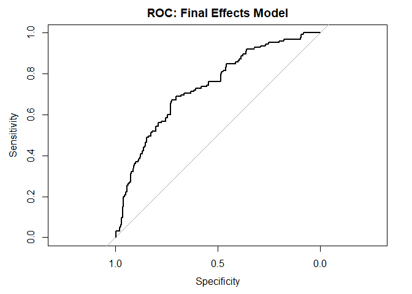
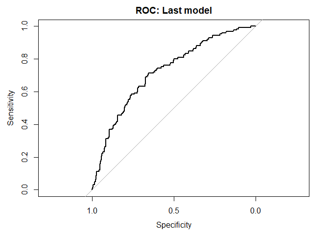
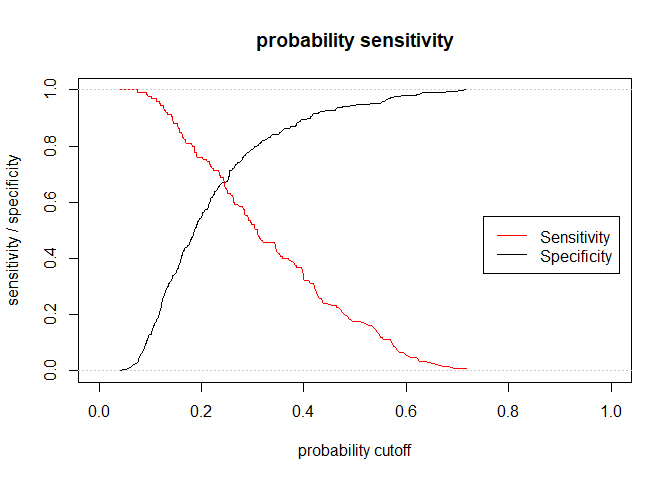

### Get Glow dataset


```r
glow <- read_glow_dataset()
```

### model interactions - main effects

```
model_z1 <- glm(FRACTURE ~ AGE, family = binomial, data = glow)
model_z2 <- glm(FRACTURE ~ WEIGHT, family = binomial, data = glow)
model_z3 <- glm(FRACTURE ~ HEIGHT, family = binomial, data = glow)
model_z4 <- glm(FRACTURE ~ BMI, family = binomial, data = glow)
model_z5 <- glm(FRACTURE ~ PRIORFRAC, family = binomial, data = glow)
model_z6 <- glm(FRACTURE ~ PREMENO, family = binomial, data = glow)
model_z7 <- glm(FRACTURE ~ MOMFRAC, family = binomial, data = glow)
model_z8 <- glm(FRACTURE ~ ARMASSIST, family = binomial, data = glow)
model_z9 <- glm(FRACTURE ~ SMOKE, family = binomial, data = glow)
model_z10 <- glm(FRACTURE ~ RATERISK, family = binomial, data = glow)

## AGE          0.05289    0.01163   4.548 5.42e-06 ***
## WEIGHT      -0.005197   0.006415 -0.810    0.418
## HEIGHT      -0.05167    0.01709  -3.022  0.00251 **
## BMI          0.005758   0.017185  0.335  0.73760  
## PRIORFRACYes 1.0638     0.2231    4.769 1.85e-06 ***
## PREMENOYes   0.05077    0.25921   0.196    0.845  
## MOMFRACYes   0.6605     0.2810    2.351   0.0187 *  
## ARMASSISTYes 0.7091     0.2098    3.381 0.000723 ***
## SMOKEYes    -0.3077     0.4358   -0.706     0.48    
## RATERISKSame      0.5462     0.2664   2.050   0.0404 *  
## RATERISKGreater   0.9091     0.2711   3.353   0.0008 ***

> code below:
```

This leads us to consider the covariates above that are significant in the univariate results above at the 25% level.

AGE, HEIGHT, PRIORFRAC, MOMFRAC, ARMASSIST, RATERISK {SAME, GREATER}


```r
# fit a univariate logistic regression model for each covariate
# continuous - AGE WEIGHT HEIGHT BMI
# categorical - PRIORFRAC PREMENO MOMFRAC ARMASSIST SMOKE RATERISK

# model0
#model_z1 <- glm(FRACTURE ~ AGE, family = binomial, data = glow)
#model_z2 <- glm(FRACTURE ~ WEIGHT, family = binomial, data = glow)
#model_z3 <- glm(FRACTURE ~ HEIGHT, family = binomial, data = glow)
#model_z4 <- glm(FRACTURE ~ BMI, family = binomial, data = glow)
#model_z5 <- glm(FRACTURE ~ PRIORFRAC, family = binomial, data = glow)
#model_z6 <- glm(FRACTURE ~ PREMENO, family = binomial, data = glow)
#model_z7 <- glm(FRACTURE ~ MOMFRAC, family = binomial, data = glow)
#model_z8 <- glm(FRACTURE ~ ARMASSIST, family = binomial, data = glow)
#model_z9 <- glm(FRACTURE ~ SMOKE, family = binomial, data = glow)
#model_z10 <- glm(FRACTURE ~ RATERISK, family = binomial, data = glow)

#summary(model_z1)
#summary(model_z2)
#summary(model_z3)
#summary(model_z4)
#summary(model_z5)
#summary(model_z6)
#summary(model_z7)
#summary(model_z8)
#summary(model_z9)
#summary(model_z10)

# not interesting due to all variables (i.e. SUB_ID, SITE_ID, PHY_ID)
# model00 <- glm(FRACTURE ~ ., family = binomial, data = glow)
# summary(model00)

# full model, order by continuous, then factor
model0 <- glm(FRACTURE ~ AGE + WEIGHT + HEIGHT + BMI + PRIORFRAC + PREMENO + MOMFRAC + ARMASSIST + SMOKE + RATERISK, family = binomial, data = glow) 
summary(model0)
```

```
## 
## Call:
## glm(formula = FRACTURE ~ AGE + WEIGHT + HEIGHT + BMI + PRIORFRAC + 
##     PREMENO + MOMFRAC + ARMASSIST + SMOKE + RATERISK, family = binomial, 
##     data = glow)
## 
## Deviance Residuals: 
##     Min       1Q   Median       3Q      Max  
## -1.6811  -0.7228  -0.5639  -0.1008   2.2182  
## 
## Coefficients:
##                  Estimate Std. Error z value Pr(>|z|)   
## (Intercept)     -15.74709   12.67053  -1.243  0.21394   
## AGE               0.03895    0.01476   2.640  0.00829 **
## WEIGHT           -0.12189    0.08664  -1.407  0.15949   
## HEIGHT            0.06620    0.07825   0.846  0.39755   
## BMI               0.33181    0.22339   1.485  0.13745   
## PRIORFRACYes      0.67577    0.25012   2.702  0.00690 **
## PREMENOYes        0.10080    0.28540   0.353  0.72395   
## MOMFRACYes        0.63438    0.30784   2.061  0.03933 * 
## ARMASSISTYes      0.36102    0.25647   1.408  0.15924   
## SMOKEYes         -0.31228    0.46216  -0.676  0.49923   
## RATERISKSame      0.42256    0.28144   1.501  0.13324   
## RATERISKGreater   0.75645    0.29944   2.526  0.01153 * 
## ---
## Signif. codes:  0 '***' 0.001 '**' 0.01 '*' 0.05 '.' 0.1 ' ' 1
## 
## (Dispersion parameter for binomial family taken to be 1)
## 
##     Null deviance: 562.34  on 499  degrees of freedom
## Residual deviance: 503.84  on 488  degrees of freedom
## AIC: 527.84
## 
## Number of Fisher Scoring iterations: 4
```

```r
# fit model # note - should remove below model1
model0_fitted <- update(model0, . ~ . - WEIGHT - BMI - PREMENO - SMOKE)
summary(model0_fitted)
```

```
## 
## Call:
## glm(formula = FRACTURE ~ AGE + HEIGHT + PRIORFRAC + MOMFRAC + 
##     ARMASSIST + RATERISK, family = binomial, data = glow)
## 
## Deviance Residuals: 
##      Min        1Q    Median        3Q       Max  
## -1.66692  -0.72502  -0.56338  -0.03841   2.22148  
## 
## Coefficients:
##                 Estimate Std. Error z value Pr(>|z|)   
## (Intercept)      2.70935    3.22992   0.839  0.40157   
## AGE              0.03434    0.01305   2.632  0.00848 **
## HEIGHT          -0.04383    0.01827  -2.400  0.01640 * 
## PRIORFRACYes     0.64526    0.24606   2.622  0.00873 **
## MOMFRACYes       0.62122    0.30698   2.024  0.04300 * 
## ARMASSISTYes     0.44579    0.23281   1.915  0.05551 . 
## RATERISKSame     0.42202    0.27925   1.511  0.13071   
## RATERISKGreater  0.70692    0.29342   2.409  0.01599 * 
## ---
## Signif. codes:  0 '***' 0.001 '**' 0.01 '*' 0.05 '.' 0.1 ' ' 1
## 
## (Dispersion parameter for binomial family taken to be 1)
## 
##     Null deviance: 562.34  on 499  degrees of freedom
## Residual deviance: 507.50  on 492  degrees of freedom
## AIC: 523.5
## 
## Number of Fisher Scoring iterations: 4
```

```r
# build model with following covariates (drop WEIGHT, BMI, PREMENO, SMOKE)
# AGE, HEIGHT, PRIORFRAC, MOMFRAC, ARMASSIST, RATERISK {SAME, GREATER}

model1 <- glm(FRACTURE ~ AGE + HEIGHT + PRIORFRAC + MOMFRAC + ARMASSIST + RATERISK, family = binomial, data = glow) 
summary(model1)
```

```
## 
## Call:
## glm(formula = FRACTURE ~ AGE + HEIGHT + PRIORFRAC + MOMFRAC + 
##     ARMASSIST + RATERISK, family = binomial, data = glow)
## 
## Deviance Residuals: 
##      Min        1Q    Median        3Q       Max  
## -1.66692  -0.72502  -0.56338  -0.03841   2.22148  
## 
## Coefficients:
##                 Estimate Std. Error z value Pr(>|z|)   
## (Intercept)      2.70935    3.22992   0.839  0.40157   
## AGE              0.03434    0.01305   2.632  0.00848 **
## HEIGHT          -0.04383    0.01827  -2.400  0.01640 * 
## PRIORFRACYes     0.64526    0.24606   2.622  0.00873 **
## MOMFRACYes       0.62122    0.30698   2.024  0.04300 * 
## ARMASSISTYes     0.44579    0.23281   1.915  0.05551 . 
## RATERISKSame     0.42202    0.27925   1.511  0.13071   
## RATERISKGreater  0.70692    0.29342   2.409  0.01599 * 
## ---
## Signif. codes:  0 '***' 0.001 '**' 0.01 '*' 0.05 '.' 0.1 ' ' 1
## 
## (Dispersion parameter for binomial family taken to be 1)
## 
##     Null deviance: 562.34  on 499  degrees of freedom
## Residual deviance: 507.50  on 492  degrees of freedom
## AIC: 523.5
## 
## Number of Fisher Scoring iterations: 4
```

```r
# from above result, adding back the removed covariates we see they are not needed to keep the remaining covariates
# this becomes the model, adding back removed covariates WEIGHT, BMI, PREMENO, SMOKE the coefficients didn't become significant
# this becomes the main effects model


# need to check scale of logit for remaining continous variables AGE HEIGHT
# assume HEIGHT is linearin logit
```

## The main effects model
model1 <- glm(FRACTURE ~ AGE + HEIGHT + PRIORFRAC + MOMFRAC + ARMASSIST + RATERISK, family = binomial, data = glow) 

use lrtest from package lmtest


### test interactions for the following:

5. AGE: [HEIGHT, PRIORFRAC, MOMFRAC, ARMASSIST, RATERISK]
4. HEIGHT: [PRIORFRAC, MOMFRAC, ARMASSIST, RATERISK]
3. PRIORFRAC: [MOMFRAC, ARMASSIST, RATERISK]
2. MOMFRAC: [ARMASSIST, RATERISK]
1. ARMASSIST: RATERISK  

total 15 interactions


```r
library(lmtest)
```

```
## Loading required package: zoo
```

```
## 
## Attaching package: 'zoo'
```

```
## The following objects are masked from 'package:base':
## 
##     as.Date, as.Date.numeric
```

```r
# model AGE* , HEIGHT* , PRIORFRAC*

model_effects <- glm(FRACTURE ~ AGE + HEIGHT + PRIORFRAC + MOMFRAC + ARMASSIST + RATERISK, family = binomial, data = glow) 
lrtest(model_effects)
```

```
## Likelihood ratio test
## 
## Model 1: FRACTURE ~ AGE + HEIGHT + PRIORFRAC + MOMFRAC + ARMASSIST + RATERISK
## Model 2: FRACTURE ~ 1
##   #Df  LogLik Df  Chisq Pr(>Chisq)    
## 1   8 -253.75                         
## 2   1 -281.17 -7 54.835  1.608e-09 ***
## ---
## Signif. codes:  0 '***' 0.001 '**' 0.01 '*' 0.05 '.' 0.1 ' ' 1
```

```r
# (5) AGE: [HEIGHT, PRIORFRAC, MOMFRAC, ARMASSIST, RATERISK]

test <- model_effects
test <- update(test, . ~ . + AGE:HEIGHT)
summary(test)
```

```
## 
## Call:
## glm(formula = FRACTURE ~ AGE + HEIGHT + PRIORFRAC + MOMFRAC + 
##     ARMASSIST + RATERISK + AGE:HEIGHT, family = binomial, data = glow)
## 
## Deviance Residuals: 
##      Min        1Q    Median        3Q       Max  
## -1.66848  -0.73323  -0.56252   0.02069   2.23640  
## 
## Coefficients:
##                  Estimate Std. Error z value Pr(>|z|)  
## (Intercept)     14.749125  23.931667   0.616   0.5377  
## AGE             -0.135869   0.335087  -0.405   0.6851  
## HEIGHT          -0.119095   0.149402  -0.797   0.4254  
## PRIORFRACYes     0.634947   0.246751   2.573   0.0101 *
## MOMFRACYes       0.623682   0.307316   2.029   0.0424 *
## ARMASSISTYes     0.447271   0.232895   1.920   0.0548 .
## RATERISKSame     0.435127   0.280319   1.552   0.1206  
## RATERISKGreater  0.707865   0.293394   2.413   0.0158 *
## AGE:HEIGHT       0.001065   0.002095   0.508   0.6113  
## ---
## Signif. codes:  0 '***' 0.001 '**' 0.01 '*' 0.05 '.' 0.1 ' ' 1
## 
## (Dispersion parameter for binomial family taken to be 1)
## 
##     Null deviance: 562.34  on 499  degrees of freedom
## Residual deviance: 507.24  on 491  degrees of freedom
## AIC: 525.24
## 
## Number of Fisher Scoring iterations: 4
```

```r
lrtest(test)
```

```
## Likelihood ratio test
## 
## Model 1: FRACTURE ~ AGE + HEIGHT + PRIORFRAC + MOMFRAC + ARMASSIST + RATERISK + 
##     AGE:HEIGHT
## Model 2: FRACTURE ~ 1
##   #Df  LogLik Df  Chisq Pr(>Chisq)    
## 1   9 -253.62                         
## 2   1 -281.17 -8 55.096   4.23e-09 ***
## ---
## Signif. codes:  0 '***' 0.001 '**' 0.01 '*' 0.05 '.' 0.1 ' ' 1
```

```r
test <- model_effects
test <- update(test, . ~ . + AGE:PRIORFRAC)
summary(test)
```

```
## 
## Call:
## glm(formula = FRACTURE ~ AGE + HEIGHT + PRIORFRAC + MOMFRAC + 
##     ARMASSIST + RATERISK + AGE:PRIORFRAC, family = binomial, 
##     data = glow)
## 
## Deviance Residuals: 
##      Min        1Q    Median        3Q       Max  
## -1.48423  -0.74080  -0.53895  -0.00078   2.26588  
## 
## Coefficients:
##                  Estimate Std. Error z value Pr(>|z|)    
## (Intercept)       0.63708    3.35881   0.190 0.849565    
## AGE               0.05669    0.01649   3.437 0.000589 ***
## HEIGHT           -0.04058    0.01828  -2.220 0.026406 *  
## PRIORFRACYes      4.85428    1.86766   2.599 0.009346 ** 
## MOMFRACYes        0.66973    0.30857   2.170 0.029972 *  
## ARMASSISTYes      0.41887    0.23395   1.790 0.073391 .  
## RATERISKSame      0.43496    0.28053   1.551 0.121014    
## RATERISKGreater   0.72044    0.29561   2.437 0.014804 *  
## AGE:PRIORFRACYes -0.05864    0.02583  -2.270 0.023188 *  
## ---
## Signif. codes:  0 '***' 0.001 '**' 0.01 '*' 0.05 '.' 0.1 ' ' 1
## 
## (Dispersion parameter for binomial family taken to be 1)
## 
##     Null deviance: 562.34  on 499  degrees of freedom
## Residual deviance: 502.34  on 491  degrees of freedom
## AIC: 520.34
## 
## Number of Fisher Scoring iterations: 4
```

```r
lrtest(test)
```

```
## Likelihood ratio test
## 
## Model 1: FRACTURE ~ AGE + HEIGHT + PRIORFRAC + MOMFRAC + ARMASSIST + RATERISK + 
##     AGE:PRIORFRAC
## Model 2: FRACTURE ~ 1
##   #Df  LogLik Df  Chisq Pr(>Chisq)    
## 1   9 -251.17                         
## 2   1 -281.17 -8 59.991  4.679e-10 ***
## ---
## Signif. codes:  0 '***' 0.001 '**' 0.01 '*' 0.05 '.' 0.1 ' ' 1
```

```r
test <- model_effects
test <- update(test, . ~ . + AGE:MOMFRAC)
summary(test)
```

```
## 
## Call:
## glm(formula = FRACTURE ~ AGE + HEIGHT + PRIORFRAC + MOMFRAC + 
##     ARMASSIST + RATERISK + AGE:MOMFRAC, family = binomial, data = glow)
## 
## Deviance Residuals: 
##      Min        1Q    Median        3Q       Max  
## -1.58376  -0.72859  -0.56182  -0.02562   2.22962  
## 
## Coefficients:
##                 Estimate Std. Error z value Pr(>|z|)   
## (Intercept)      2.59055    3.24368   0.799  0.42450   
## AGE              0.03633    0.01393   2.609  0.00908 **
## HEIGHT          -0.04402    0.01827  -2.409  0.01601 * 
## PRIORFRACYes     0.65010    0.24630   2.639  0.00830 **
## MOMFRACYes       1.57119    2.31121   0.680  0.49662   
## ARMASSISTYes     0.45447    0.23374   1.944  0.05185 . 
## RATERISKSame     0.42505    0.27940   1.521  0.12819   
## RATERISKGreater  0.71044    0.29363   2.420  0.01554 * 
## AGE:MOMFRACYes  -0.01353    0.03264  -0.414  0.67854   
## ---
## Signif. codes:  0 '***' 0.001 '**' 0.01 '*' 0.05 '.' 0.1 ' ' 1
## 
## (Dispersion parameter for binomial family taken to be 1)
## 
##     Null deviance: 562.34  on 499  degrees of freedom
## Residual deviance: 507.33  on 491  degrees of freedom
## AIC: 525.33
## 
## Number of Fisher Scoring iterations: 4
```

```r
lrtest(test)
```

```
## Likelihood ratio test
## 
## Model 1: FRACTURE ~ AGE + HEIGHT + PRIORFRAC + MOMFRAC + ARMASSIST + RATERISK + 
##     AGE:MOMFRAC
## Model 2: FRACTURE ~ 1
##   #Df  LogLik Df  Chisq Pr(>Chisq)    
## 1   9 -253.66                         
## 2   1 -281.17 -8 55.005  4.406e-09 ***
## ---
## Signif. codes:  0 '***' 0.001 '**' 0.01 '*' 0.05 '.' 0.1 ' ' 1
```

```r
test <- model_effects
test <- update(test, . ~ . + AGE:ARMASSIST)
summary(test)
```

```
## 
## Call:
## glm(formula = FRACTURE ~ AGE + HEIGHT + PRIORFRAC + MOMFRAC + 
##     ARMASSIST + RATERISK + AGE:ARMASSIST, family = binomial, 
##     data = glow)
## 
## Deviance Residuals: 
##     Min       1Q   Median       3Q      Max  
## -1.6352  -0.7272  -0.5646  -0.0295   2.2329  
## 
## Coefficients:
##                  Estimate Std. Error z value Pr(>|z|)   
## (Intercept)       2.33972    3.33003   0.703  0.48230   
## AGE               0.03990    0.01785   2.235  0.02542 * 
## HEIGHT           -0.04395    0.01827  -2.406  0.01614 * 
## PRIORFRACYes      0.64031    0.24609   2.602  0.00927 **
## MOMFRACYes        0.63376    0.30795   2.058  0.03959 * 
## ARMASSISTYes      1.24419    1.76410   0.705  0.48063   
## RATERISKSame      0.42815    0.27964   1.531  0.12575   
## RATERISKGreater   0.71996    0.29494   2.441  0.01464 * 
## AGE:ARMASSISTYes -0.01132    0.02479  -0.457  0.64802   
## ---
## Signif. codes:  0 '***' 0.001 '**' 0.01 '*' 0.05 '.' 0.1 ' ' 1
## 
## (Dispersion parameter for binomial family taken to be 1)
## 
##     Null deviance: 562.34  on 499  degrees of freedom
## Residual deviance: 507.29  on 491  degrees of freedom
## AIC: 525.29
## 
## Number of Fisher Scoring iterations: 4
```

```r
lrtest(test)
```

```
## Likelihood ratio test
## 
## Model 1: FRACTURE ~ AGE + HEIGHT + PRIORFRAC + MOMFRAC + ARMASSIST + RATERISK + 
##     AGE:ARMASSIST
## Model 2: FRACTURE ~ 1
##   #Df  LogLik Df  Chisq Pr(>Chisq)    
## 1   9 -253.65                         
## 2   1 -281.17 -8 55.043  4.331e-09 ***
## ---
## Signif. codes:  0 '***' 0.001 '**' 0.01 '*' 0.05 '.' 0.1 ' ' 1
```

```r
test <- model_effects
test <- update(test, . ~ . + AGE:RATERISK)
summary(test)
```

```
## 
## Call:
## glm(formula = FRACTURE ~ AGE + HEIGHT + PRIORFRAC + MOMFRAC + 
##     ARMASSIST + RATERISK + AGE:RATERISK, family = binomial, data = glow)
## 
## Deviance Residuals: 
##      Min        1Q    Median        3Q       Max  
## -1.68668  -0.74463  -0.56590  -0.02638   2.34976  
## 
## Coefficients:
##                     Estimate Std. Error z value Pr(>|z|)   
## (Intercept)          0.53632    3.53444   0.152  0.87939   
## AGE                  0.06673    0.02473   2.698  0.00697 **
## HEIGHT              -0.04496    0.01840  -2.443  0.01456 * 
## PRIORFRACYes         0.65827    0.24598   2.676  0.00745 **
## MOMFRACYes           0.65241    0.30765   2.121  0.03395 * 
## ARMASSISTYes         0.48569    0.23443   2.072  0.03828 * 
## RATERISKSame         3.28427    2.27575   1.443  0.14898   
## RATERISKGreater      4.25804    2.28873   1.860  0.06282 . 
## AGE:RATERISKSame    -0.03999    0.03151  -1.269  0.20438   
## AGE:RATERISKGreater -0.05021    0.03202  -1.568  0.11690   
## ---
## Signif. codes:  0 '***' 0.001 '**' 0.01 '*' 0.05 '.' 0.1 ' ' 1
## 
## (Dispersion parameter for binomial family taken to be 1)
## 
##     Null deviance: 562.34  on 499  degrees of freedom
## Residual deviance: 504.79  on 490  degrees of freedom
## AIC: 524.79
## 
## Number of Fisher Scoring iterations: 5
```

```r
lrtest(test)
```

```
## Likelihood ratio test
## 
## Model 1: FRACTURE ~ AGE + HEIGHT + PRIORFRAC + MOMFRAC + ARMASSIST + RATERISK + 
##     AGE:RATERISK
## Model 2: FRACTURE ~ 1
##   #Df  LogLik Df Chisq Pr(>Chisq)    
## 1  10 -252.40                        
## 2   1 -281.17 -9 57.54  3.982e-09 ***
## ---
## Signif. codes:  0 '***' 0.001 '**' 0.01 '*' 0.05 '.' 0.1 ' ' 1
```

```r
# (4) HEIGHT: [PRIORFRAC, MOMFRAC, ARMASSIST, RATERISK]

test <- model_effects
test <- update(test, . ~ . + HEIGHT:PRIORFRAC)
summary(test)
```

```
## 
## Call:
## glm(formula = FRACTURE ~ AGE + HEIGHT + PRIORFRAC + MOMFRAC + 
##     ARMASSIST + RATERISK + HEIGHT:PRIORFRAC, family = binomial, 
##     data = glow)
## 
## Deviance Residuals: 
##     Min       1Q   Median       3Q      Max  
## -1.6670  -0.7274  -0.5615  -0.0037   2.2377  
## 
## Coefficients:
##                     Estimate Std. Error z value Pr(>|z|)   
## (Intercept)          3.79297    3.89138   0.975  0.32970   
## AGE                  0.03395    0.01307   2.597  0.00941 **
## HEIGHT              -0.05041    0.02253  -2.238  0.02524 * 
## PRIORFRACYes        -2.41864    6.03699  -0.401  0.68869   
## MOMFRACYes           0.63692    0.30850   2.065  0.03896 * 
## ARMASSISTYes         0.43526    0.23394   1.861  0.06281 . 
## RATERISKSame         0.42634    0.27946   1.526  0.12711   
## RATERISKGreater      0.70410    0.29356   2.399  0.01646 * 
## HEIGHT:PRIORFRACYes  0.01915    0.03770   0.508  0.61146   
## ---
## Signif. codes:  0 '***' 0.001 '**' 0.01 '*' 0.05 '.' 0.1 ' ' 1
## 
## (Dispersion parameter for binomial family taken to be 1)
## 
##     Null deviance: 562.34  on 499  degrees of freedom
## Residual deviance: 507.24  on 491  degrees of freedom
## AIC: 525.24
## 
## Number of Fisher Scoring iterations: 4
```

```r
lrtest(test)
```

```
## Likelihood ratio test
## 
## Model 1: FRACTURE ~ AGE + HEIGHT + PRIORFRAC + MOMFRAC + ARMASSIST + RATERISK + 
##     HEIGHT:PRIORFRAC
## Model 2: FRACTURE ~ 1
##   #Df  LogLik Df  Chisq Pr(>Chisq)    
## 1   9 -253.62                         
## 2   1 -281.17 -8 55.092  4.236e-09 ***
## ---
## Signif. codes:  0 '***' 0.001 '**' 0.01 '*' 0.05 '.' 0.1 ' ' 1
```

```r
test <- model_effects
test <- update(test, . ~ . + HEIGHT:MOMFRAC)
summary(test)
```

```
## 
## Call:
## glm(formula = FRACTURE ~ AGE + HEIGHT + PRIORFRAC + MOMFRAC + 
##     ARMASSIST + RATERISK + HEIGHT:MOMFRAC, family = binomial, 
##     data = glow)
## 
## Deviance Residuals: 
##      Min        1Q    Median        3Q       Max  
## -1.62068  -0.74163  -0.55649   0.06604   2.26717  
## 
## Coefficients:
##                    Estimate Std. Error z value Pr(>|z|)   
## (Intercept)         4.73834    3.51132   1.349  0.17719   
## AGE                 0.03385    0.01307   2.589  0.00961 **
## HEIGHT             -0.05646    0.02021  -2.794  0.00521 **
## PRIORFRACYes        0.68102    0.24763   2.750  0.00596 **
## MOMFRACYes        -11.35526    7.64959  -1.484  0.13770   
## ARMASSISTYes        0.47848    0.23444   2.041  0.04126 * 
## RATERISKSame        0.42455    0.28002   1.516  0.12949   
## RATERISKGreater     0.70475    0.29372   2.399  0.01642 * 
## HEIGHT:MOMFRACYes   0.07401    0.04718   1.569  0.11675   
## ---
## Signif. codes:  0 '***' 0.001 '**' 0.01 '*' 0.05 '.' 0.1 ' ' 1
## 
## (Dispersion parameter for binomial family taken to be 1)
## 
##     Null deviance: 562.34  on 499  degrees of freedom
## Residual deviance: 505.08  on 491  degrees of freedom
## AIC: 523.08
## 
## Number of Fisher Scoring iterations: 4
```

```r
lrtest(test)
```

```
## Likelihood ratio test
## 
## Model 1: FRACTURE ~ AGE + HEIGHT + PRIORFRAC + MOMFRAC + ARMASSIST + RATERISK + 
##     HEIGHT:MOMFRAC
## Model 2: FRACTURE ~ 1
##   #Df  LogLik Df  Chisq Pr(>Chisq)    
## 1   9 -252.54                         
## 2   1 -281.17 -8 57.258  1.603e-09 ***
## ---
## Signif. codes:  0 '***' 0.001 '**' 0.01 '*' 0.05 '.' 0.1 ' ' 1
```

```r
test <- model_effects
test <- update(test, . ~ . + HEIGHT:ARMASSIST)
summary(test)
```

```
## 
## Call:
## glm(formula = FRACTURE ~ AGE + HEIGHT + PRIORFRAC + MOMFRAC + 
##     ARMASSIST + RATERISK + HEIGHT:ARMASSIST, family = binomial, 
##     data = glow)
## 
## Deviance Residuals: 
##     Min       1Q   Median       3Q      Max  
## -1.6742  -0.7177  -0.5638  -0.1472   2.1734  
## 
## Coefficients:
##                     Estimate Std. Error z value Pr(>|z|)   
## (Intercept)         -0.57428    4.12234  -0.139  0.88920   
## AGE                  0.03401    0.01308   2.601  0.00931 **
## HEIGHT              -0.02318    0.02432  -0.953  0.34051   
## PRIORFRACYes         0.67913    0.24841   2.734  0.00626 **
## MOMFRACYes           0.58729    0.30807   1.906  0.05660 . 
## ARMASSISTYes         7.53985    5.77628   1.305  0.19179   
## RATERISKSame         0.41583    0.27981   1.486  0.13725   
## RATERISKGreater      0.70729    0.29369   2.408  0.01603 * 
## HEIGHT:ARMASSISTYes -0.04419    0.03594  -1.229  0.21890   
## ---
## Signif. codes:  0 '***' 0.001 '**' 0.01 '*' 0.05 '.' 0.1 ' ' 1
## 
## (Dispersion parameter for binomial family taken to be 1)
## 
##     Null deviance: 562.34  on 499  degrees of freedom
## Residual deviance: 505.98  on 491  degrees of freedom
## AIC: 523.98
## 
## Number of Fisher Scoring iterations: 4
```

```r
lrtest(test)
```

```
## Likelihood ratio test
## 
## Model 1: FRACTURE ~ AGE + HEIGHT + PRIORFRAC + MOMFRAC + ARMASSIST + RATERISK + 
##     HEIGHT:ARMASSIST
## Model 2: FRACTURE ~ 1
##   #Df  LogLik Df  Chisq Pr(>Chisq)    
## 1   9 -252.99                         
## 2   1 -281.17 -8 56.352  2.409e-09 ***
## ---
## Signif. codes:  0 '***' 0.001 '**' 0.01 '*' 0.05 '.' 0.1 ' ' 1
```

```r
test <- model_effects
test <- update(test, . ~ . + HEIGHT:RATERISK)
summary(test)
```

```
## 
## Call:
## glm(formula = FRACTURE ~ AGE + HEIGHT + PRIORFRAC + MOMFRAC + 
##     ARMASSIST + RATERISK + HEIGHT:RATERISK, family = binomial, 
##     data = glow)
## 
## Deviance Residuals: 
##      Min        1Q    Median        3Q       Max  
## -1.64936  -0.72375  -0.57251  -0.05841   2.22612  
## 
## Coefficients:
##                        Estimate Std. Error z value Pr(>|z|)   
## (Intercept)             3.25641    5.81516   0.560  0.57549   
## AGE                     0.03321    0.01310   2.536  0.01122 * 
## HEIGHT                 -0.04674    0.03532  -1.323  0.18573   
## PRIORFRACYes            0.64451    0.24655   2.614  0.00895 **
## MOMFRACYes              0.62504    0.30650   2.039  0.04142 * 
## ARMASSISTYes            0.44610    0.23290   1.915  0.05544 . 
## RATERISKSame            2.93823    7.29965   0.403  0.68730   
## RATERISKGreater        -3.15056    7.29448  -0.432  0.66581   
## HEIGHT:RATERISKSame    -0.01577    0.04550  -0.347  0.72890   
## HEIGHT:RATERISKGreater  0.02394    0.04528   0.529  0.59695   
## ---
## Signif. codes:  0 '***' 0.001 '**' 0.01 '*' 0.05 '.' 0.1 ' ' 1
## 
## (Dispersion parameter for binomial family taken to be 1)
## 
##     Null deviance: 562.34  on 499  degrees of freedom
## Residual deviance: 506.55  on 490  degrees of freedom
## AIC: 526.55
## 
## Number of Fisher Scoring iterations: 4
```

```r
lrtest(test)
```

```
## Likelihood ratio test
## 
## Model 1: FRACTURE ~ AGE + HEIGHT + PRIORFRAC + MOMFRAC + ARMASSIST + RATERISK + 
##     HEIGHT:RATERISK
## Model 2: FRACTURE ~ 1
##   #Df  LogLik Df  Chisq Pr(>Chisq)    
## 1  10 -253.28                         
## 2   1 -281.17 -9 55.786  8.624e-09 ***
## ---
## Signif. codes:  0 '***' 0.001 '**' 0.01 '*' 0.05 '.' 0.1 ' ' 1
```

```r
# (3) PRIORFRAC: [MOMFRAC, ARMASSIST, RATERISK]

test <- model_effects
test <- update(test, . ~ . + PRIORFRAC:MOMFRAC)
summary(test)
```

```
## 
## Call:
## glm(formula = FRACTURE ~ AGE + HEIGHT + PRIORFRAC + MOMFRAC + 
##     ARMASSIST + RATERISK + PRIORFRAC:MOMFRAC, family = binomial, 
##     data = glow)
## 
## Deviance Residuals: 
##      Min        1Q    Median        3Q       Max  
## -1.52616  -0.73215  -0.54992   0.02399   2.25279  
## 
## Coefficients:
##                         Estimate Std. Error z value Pr(>|z|)   
## (Intercept)              2.97592    3.23781   0.919  0.35804   
## AGE                      0.03598    0.01313   2.741  0.00612 **
## HEIGHT                  -0.04652    0.01837  -2.533  0.01130 * 
## PRIORFRACYes             0.80102    0.26285   3.047  0.00231 **
## MOMFRACYes               0.95902    0.35985   2.665  0.00770 **
## ARMASSISTYes             0.43294    0.23384   1.851  0.06411 . 
## RATERISKSame             0.41959    0.28027   1.497  0.13437   
## RATERISKGreater          0.71282    0.29401   2.425  0.01533 * 
## PRIORFRACYes:MOMFRACYes -1.07823    0.65021  -1.658  0.09726 . 
## ---
## Signif. codes:  0 '***' 0.001 '**' 0.01 '*' 0.05 '.' 0.1 ' ' 1
## 
## (Dispersion parameter for binomial family taken to be 1)
## 
##     Null deviance: 562.34  on 499  degrees of freedom
## Residual deviance: 504.75  on 491  degrees of freedom
## AIC: 522.75
## 
## Number of Fisher Scoring iterations: 4
```

```r
lrtest(test)
```

```
## Likelihood ratio test
## 
## Model 1: FRACTURE ~ AGE + HEIGHT + PRIORFRAC + MOMFRAC + ARMASSIST + RATERISK + 
##     PRIORFRAC:MOMFRAC
## Model 2: FRACTURE ~ 1
##   #Df  LogLik Df Chisq Pr(>Chisq)    
## 1   9 -252.37                        
## 2   1 -281.17 -8 57.59  1.382e-09 ***
## ---
## Signif. codes:  0 '***' 0.001 '**' 0.01 '*' 0.05 '.' 0.1 ' ' 1
```

```r
test <- model_effects
test <- update(test, . ~ . + PRIORFRAC:ARMASSIST)
summary(test)
```

```
## 
## Call:
## glm(formula = FRACTURE ~ AGE + HEIGHT + PRIORFRAC + MOMFRAC + 
##     ARMASSIST + RATERISK + PRIORFRAC:ARMASSIST, family = binomial, 
##     data = glow)
## 
## Deviance Residuals: 
##      Min        1Q    Median        3Q       Max  
## -1.69860  -0.71874  -0.56691  -0.04199   2.21033  
## 
## Coefficients:
##                           Estimate Std. Error z value Pr(>|z|)   
## (Intercept)                2.90711    3.25923   0.892  0.37241   
## AGE                        0.03434    0.01306   2.630  0.00854 **
## HEIGHT                    -0.04486    0.01842  -2.436  0.01487 * 
## PRIORFRACYes               0.52412    0.34418   1.523  0.12780   
## MOMFRACYes                 0.63247    0.30798   2.054  0.04001 * 
## ARMASSISTYes               0.36456    0.28322   1.287  0.19803   
## RATERISKSame               0.42507    0.27929   1.522  0.12802   
## RATERISKGreater            0.68837    0.29591   2.326  0.02000 * 
## PRIORFRACYes:ARMASSISTYes  0.24587    0.48467   0.507  0.61194   
## ---
## Signif. codes:  0 '***' 0.001 '**' 0.01 '*' 0.05 '.' 0.1 ' ' 1
## 
## (Dispersion parameter for binomial family taken to be 1)
## 
##     Null deviance: 562.34  on 499  degrees of freedom
## Residual deviance: 507.24  on 491  degrees of freedom
## AIC: 525.24
## 
## Number of Fisher Scoring iterations: 4
```

```r
lrtest(test)
```

```
## Likelihood ratio test
## 
## Model 1: FRACTURE ~ AGE + HEIGHT + PRIORFRAC + MOMFRAC + ARMASSIST + RATERISK + 
##     PRIORFRAC:ARMASSIST
## Model 2: FRACTURE ~ 1
##   #Df  LogLik Df  Chisq Pr(>Chisq)    
## 1   9 -253.62                         
## 2   1 -281.17 -8 55.093  4.235e-09 ***
## ---
## Signif. codes:  0 '***' 0.001 '**' 0.01 '*' 0.05 '.' 0.1 ' ' 1
```

```r
test <- model_effects
test <- update(test, . ~ . + PRIORFRAC:RATERISK)
summary(test)
```

```
## 
## Call:
## glm(formula = FRACTURE ~ AGE + HEIGHT + PRIORFRAC + MOMFRAC + 
##     ARMASSIST + RATERISK + PRIORFRAC:RATERISK, family = binomial, 
##     data = glow)
## 
## Deviance Residuals: 
##      Min        1Q    Median        3Q       Max  
## -1.69776  -0.71989  -0.56384  -0.03822   2.21130  
## 
## Coefficients:
##                               Estimate Std. Error z value Pr(>|z|)   
## (Intercept)                   2.733523   3.235459   0.845  0.39819   
## AGE                           0.034508   0.013060   2.642  0.00823 **
## HEIGHT                       -0.043896   0.018313  -2.397  0.01653 * 
## PRIORFRACYes                  0.564292   0.497212   1.135  0.25641   
## MOMFRACYes                    0.623104   0.307302   2.028  0.04260 * 
## ARMASSISTYes                  0.429891   0.236033   1.821  0.06856 . 
## RATERISKSame                  0.426181   0.324504   1.313  0.18907   
## RATERISKGreater               0.632806   0.355571   1.780  0.07513 . 
## PRIORFRACYes:RATERISKSame     0.001597   0.625563   0.003  0.99796   
## PRIORFRACYes:RATERISKGreater  0.208811   0.624586   0.334  0.73814   
## ---
## Signif. codes:  0 '***' 0.001 '**' 0.01 '*' 0.05 '.' 0.1 ' ' 1
## 
## (Dispersion parameter for binomial family taken to be 1)
## 
##     Null deviance: 562.34  on 499  degrees of freedom
## Residual deviance: 507.32  on 490  degrees of freedom
## AIC: 527.32
## 
## Number of Fisher Scoring iterations: 4
```

```r
lrtest(test)
```

```
## Likelihood ratio test
## 
## Model 1: FRACTURE ~ AGE + HEIGHT + PRIORFRAC + MOMFRAC + ARMASSIST + RATERISK + 
##     PRIORFRAC:RATERISK
## Model 2: FRACTURE ~ 1
##   #Df  LogLik Df  Chisq Pr(>Chisq)    
## 1  10 -253.66                         
## 2   1 -281.17 -9 55.015   1.21e-08 ***
## ---
## Signif. codes:  0 '***' 0.001 '**' 0.01 '*' 0.05 '.' 0.1 ' ' 1
```

```r
# (2) MOMFRAC: [ARMASSIST, RATERISK]

test <- model_effects
test <- update(test, . ~ . + MOMFRAC:ARMASSIST)
summary(test)
```

```
## 
## Call:
## glm(formula = FRACTURE ~ AGE + HEIGHT + PRIORFRAC + MOMFRAC + 
##     ARMASSIST + RATERISK + MOMFRAC:ARMASSIST, family = binomial, 
##     data = glow)
## 
## Deviance Residuals: 
##      Min        1Q    Median        3Q       Max  
## -1.65273  -0.72683  -0.55140   0.03367   2.27218  
## 
## Coefficients:
##                         Estimate Std. Error z value Pr(>|z|)   
## (Intercept)              2.96640    3.25148   0.912  0.36160   
## AGE                      0.03760    0.01323   2.842  0.00448 **
## HEIGHT                  -0.04738    0.01846  -2.567  0.01025 * 
## PRIORFRACYes             0.61633    0.24770   2.488  0.01284 * 
## MOMFRACYes               1.17111    0.38940   3.007  0.00263 **
## ARMASSISTYes             0.65026    0.25220   2.578  0.00993 **
## RATERISKSame             0.41386    0.28032   1.476  0.13985   
## RATERISKGreater          0.71051    0.29445   2.413  0.01582 * 
## MOMFRACYes:ARMASSISTYes -1.33817    0.62405  -2.144  0.03201 * 
## ---
## Signif. codes:  0 '***' 0.001 '**' 0.01 '*' 0.05 '.' 0.1 ' ' 1
## 
## (Dispersion parameter for binomial family taken to be 1)
## 
##     Null deviance: 562.34  on 499  degrees of freedom
## Residual deviance: 502.83  on 491  degrees of freedom
## AIC: 520.83
## 
## Number of Fisher Scoring iterations: 4
```

```r
lrtest(test)
```

```
## Likelihood ratio test
## 
## Model 1: FRACTURE ~ AGE + HEIGHT + PRIORFRAC + MOMFRAC + ARMASSIST + RATERISK + 
##     MOMFRAC:ARMASSIST
## Model 2: FRACTURE ~ 1
##   #Df  LogLik Df  Chisq Pr(>Chisq)    
## 1   9 -251.41                         
## 2   1 -281.17 -8 59.509  5.818e-10 ***
## ---
## Signif. codes:  0 '***' 0.001 '**' 0.01 '*' 0.05 '.' 0.1 ' ' 1
```

```r
test <- model_effects
test <- update(test, . ~ . + MOMFRAC:RATERISK)
summary(test)
```

```
## 
## Call:
## glm(formula = FRACTURE ~ AGE + HEIGHT + PRIORFRAC + MOMFRAC + 
##     ARMASSIST + RATERISK + MOMFRAC:RATERISK, family = binomial, 
##     data = glow)
## 
## Deviance Residuals: 
##      Min        1Q    Median        3Q       Max  
## -1.73530  -0.73156  -0.56262  -0.02886   2.20217  
## 
## Coefficients:
##                            Estimate Std. Error z value Pr(>|z|)   
## (Intercept)                 2.76974    3.23715   0.856  0.39221   
## AGE                         0.03436    0.01308   2.627  0.00861 **
## HEIGHT                     -0.04393    0.01832  -2.398  0.01649 * 
## PRIORFRACYes                0.64526    0.24663   2.616  0.00889 **
## MOMFRACYes                  0.02648    0.83795   0.032  0.97479   
## ARMASSISTYes                0.44890    0.23340   1.923  0.05444 . 
## RATERISKSame                0.29742    0.29700   1.001  0.31663   
## RATERISKGreater             0.70206    0.31167   2.253  0.02428 * 
## MOMFRACYes:RATERISKSame     1.04615    0.95957   1.090  0.27561   
## MOMFRACYes:RATERISKGreater  0.36775    0.96207   0.382  0.70227   
## ---
## Signif. codes:  0 '***' 0.001 '**' 0.01 '*' 0.05 '.' 0.1 ' ' 1
## 
## (Dispersion parameter for binomial family taken to be 1)
## 
##     Null deviance: 562.34  on 499  degrees of freedom
## Residual deviance: 505.79  on 490  degrees of freedom
## AIC: 525.79
## 
## Number of Fisher Scoring iterations: 4
```

```r
lrtest(test)
```

```
## Likelihood ratio test
## 
## Model 1: FRACTURE ~ AGE + HEIGHT + PRIORFRAC + MOMFRAC + ARMASSIST + RATERISK + 
##     MOMFRAC:RATERISK
## Model 2: FRACTURE ~ 1
##   #Df  LogLik Df  Chisq Pr(>Chisq)    
## 1  10 -252.90                         
## 2   1 -281.17 -9 56.542  6.183e-09 ***
## ---
## Signif. codes:  0 '***' 0.001 '**' 0.01 '*' 0.05 '.' 0.1 ' ' 1
```

```r
# (1) ARMASSIST: RATERISK  

test <- model_effects
test <- update(test, . ~ . + ARMASSIST:RATERISK)
summary(test)
```

```
## 
## Call:
## glm(formula = FRACTURE ~ AGE + HEIGHT + PRIORFRAC + MOMFRAC + 
##     ARMASSIST + RATERISK + ARMASSIST:RATERISK, family = binomial, 
##     data = glow)
## 
## Deviance Residuals: 
##     Min       1Q   Median       3Q      Max  
## -1.6586  -0.7419  -0.5544  -0.0470   2.2531  
## 
## Coefficients:
##                              Estimate Std. Error z value Pr(>|z|)   
## (Intercept)                   2.38363    3.22529   0.739  0.45988   
## AGE                           0.03534    0.01314   2.691  0.00713 **
## HEIGHT                       -0.04274    0.01819  -2.349  0.01883 * 
## PRIORFRACYes                  0.70856    0.25028   2.831  0.00464 **
## MOMFRACYes                    0.61378    0.30782   1.994  0.04616 * 
## ARMASSISTYes                  0.60776    0.44193   1.375  0.16906   
## RATERISKSame                  0.36244    0.36906   0.982  0.32607   
## RATERISKGreater               0.98400    0.38373   2.564  0.01034 * 
## ARMASSISTYes:RATERISKSame     0.10760    0.56723   0.190  0.84956   
## ARMASSISTYes:RATERISKGreater -0.60953    0.58200  -1.047  0.29496   
## ---
## Signif. codes:  0 '***' 0.001 '**' 0.01 '*' 0.05 '.' 0.1 ' ' 1
## 
## (Dispersion parameter for binomial family taken to be 1)
## 
##     Null deviance: 562.34  on 499  degrees of freedom
## Residual deviance: 505.42  on 490  degrees of freedom
## AIC: 525.42
## 
## Number of Fisher Scoring iterations: 4
```

```r
lrtest(test)
```

```
## Likelihood ratio test
## 
## Model 1: FRACTURE ~ AGE + HEIGHT + PRIORFRAC + MOMFRAC + ARMASSIST + RATERISK + 
##     ARMASSIST:RATERISK
## Model 2: FRACTURE ~ 1
##   #Df  LogLik Df  Chisq Pr(>Chisq)    
## 1  10 -252.71                         
## 2   1 -281.17 -9 56.912  5.253e-09 ***
## ---
## Signif. codes:  0 '***' 0.001 '**' 0.01 '*' 0.05 '.' 0.1 ' ' 1
```

### Results from interactions
``` 
## AGE:HEIGHT           0.001065   0.002095  0.508  0.6113  
   AGE:PRIORFRACYes    -0.05864    0.02583  -2.270  0.023188 *  
## AGE:MOMFRACYes      -0.01353    0.03264  -0.414  0.67854   
## AGE:ARMASSISTYes    -0.01132    0.02479  -0.457  0.64802   
## AGE:RATERISKSame    -0.03999    0.03151  -1.269  0.20438   
## AGE:RATERISKGreater -0.05021    0.03202  -1.568  0.11690  
## HEIGHT:PRIORFRACYes  0.01915    0.03770   0.508  0.61146   
## HEIGHT:MOMFRACYes    0.07401    0.04718   1.569  0.11675   
## HEIGHT:ARMASSISTYes -0.04419    0.03594  -1.229  0.21890   
## HEIGHT:RATERISKSame      -0.01577    0.04550  -0.347  0.72890   
## HEIGHT:RATERISKGreater    0.02394    0.04528   0.529  0.59695 
   PRIORFRACYes:MOMFRACYes  -1.07823    0.65021  -1.658  0.09726 . 
## PRIORFRACYes:ARMASSISTYes 0.24587    0.48467   0.507  0.61194   
## PRIORFRACYes:RATERISKSame     0.001597   0.625563   0.003  0.99796   
## PRIORFRACYes:RATERISKGreater  0.208811   0.624586   0.334  0.73814   
   MOMFRACYes:ARMASSISTYes  -1.33817    0.62405  -2.144  0.03201 * 
## MOMFRACYes:RATERISKSame     1.04615    0.95957   1.090  0.27561   
## MOMFRACYes:RATERISKGreater  0.36775    0.96207   0.382  0.70227   
## ARMASSISTYes:RATERISKSame     0.10760    0.56723   0.190  0.84956   
## ARMASSISTYes:RATERISKGreater -0.60953    0.58200  -1.047  0.29496   

```

## Add to main effects model

### we find three interactions, AGE:PRIORFRACYes, PRIORFRACYes:MOMFRACYes, MOMFRACYes:ARMASSISTYes


```r
model_effects_new <- glm(FRACTURE ~ AGE + HEIGHT + PRIORFRAC + MOMFRAC + ARMASSIST + RATERISK + 
                       AGE:PRIORFRAC + PRIORFRAC:MOMFRAC + MOMFRAC:ARMASSIST, family = binomial, data = glow) 
summary(model_effects_new)
```

```
## 
## Call:
## glm(formula = FRACTURE ~ AGE + HEIGHT + PRIORFRAC + MOMFRAC + 
##     ARMASSIST + RATERISK + AGE:PRIORFRAC + PRIORFRAC:MOMFRAC + 
##     MOMFRAC:ARMASSIST, family = binomial, data = glow)
## 
## Deviance Residuals: 
##      Min        1Q    Median        3Q       Max  
## -1.47664  -0.74929  -0.51571   0.07753   2.33224  
## 
## Coefficients:
##                         Estimate Std. Error z value Pr(>|z|)    
## (Intercept)              1.20626    3.38765   0.356 0.721785    
## AGE                      0.05949    0.01677   3.547 0.000389 ***
## HEIGHT                  -0.04610    0.01854  -2.487 0.012886 *  
## PRIORFRACYes             4.63031    1.88158   2.461 0.013860 *  
## MOMFRACYes               1.42093    0.42468   3.346 0.000820 ***
## ARMASSISTYes             0.59571    0.25545   2.332 0.019701 *  
## RATERISKSame             0.42125    0.28217   1.493 0.135462    
## RATERISKGreater          0.72341    0.29695   2.436 0.014847 *  
## AGE:PRIORFRACYes        -0.05408    0.02602  -2.079 0.037662 *  
## PRIORFRACYes:MOMFRACYes -0.83184    0.64852  -1.283 0.199606    
## MOMFRACYes:ARMASSISTYes -1.15254    0.61838  -1.864 0.062350 .  
## ---
## Signif. codes:  0 '***' 0.001 '**' 0.01 '*' 0.05 '.' 0.1 ' ' 1
## 
## (Dispersion parameter for binomial family taken to be 1)
## 
##     Null deviance: 562.34  on 499  degrees of freedom
## Residual deviance: 496.53  on 489  degrees of freedom
## AIC: 518.53
## 
## Number of Fisher Scoring iterations: 4
```

```r
# create final model with interactions terms AGE:PRIORFRAC + MOMFRAC:ARMASSIST
model_effects_final <- glm(FRACTURE ~ AGE + HEIGHT + PRIORFRAC + MOMFRAC + ARMASSIST + RATERISK + 
                       AGE:PRIORFRAC + MOMFRAC:ARMASSIST, family = binomial, data = glow) 
summary(model_effects_final)
```

```
## 
## Call:
## glm(formula = FRACTURE ~ AGE + HEIGHT + PRIORFRAC + MOMFRAC + 
##     ARMASSIST + RATERISK + AGE:PRIORFRAC + MOMFRAC:ARMASSIST, 
##     family = binomial, data = glow)
## 
## Deviance Residuals: 
##     Min       1Q   Median       3Q      Max  
## -1.6995  -0.7459  -0.5238   0.0620   2.3123  
## 
## Coefficients:
##                         Estimate Std. Error z value Pr(>|z|)    
## (Intercept)              0.96955    3.38252   0.287 0.774392    
## AGE                      0.05890    0.01666   3.535 0.000408 ***
## HEIGHT                  -0.04413    0.01848  -2.388 0.016949 *  
## PRIORFRACYes             4.65073    1.88342   2.469 0.013538 *  
## MOMFRACYes               1.19902    0.39487   3.036 0.002393 ** 
## ARMASSISTYes             0.61423    0.25358   2.422 0.015426 *  
## RATERISKSame             0.42626    0.28154   1.514 0.130012    
## RATERISKGreater          0.72116    0.29660   2.431 0.015040 *  
## AGE:PRIORFRACYes        -0.05610    0.02600  -2.158 0.030950 *  
## MOMFRACYes:ARMASSISTYes -1.26534    0.62377  -2.029 0.042507 *  
## ---
## Signif. codes:  0 '***' 0.001 '**' 0.01 '*' 0.05 '.' 0.1 ' ' 1
## 
## (Dispersion parameter for binomial family taken to be 1)
## 
##     Null deviance: 562.34  on 499  degrees of freedom
## Residual deviance: 498.17  on 490  degrees of freedom
## AIC: 518.17
## 
## Number of Fisher Scoring iterations: 4
```

## Final Interaction Model


```
(Intercept)
AGE                      0.05890    0.01666   3.535 0.000408 ***
HEIGHT                  -0.04413    0.01848  -2.388 0.016949 *  
PRIORFRACYes             4.65073    1.88342   2.469 0.013538 *  
MOMFRACYes               1.19902    0.39487   3.036 0.002393 ** 
ARMASSISTYes             0.61423    0.25358   2.422 0.015426 *  
RATERISKGreater          0.72116    0.29660   2.431 0.015040 *  
AGE:PRIORFRACYes        -0.05610    0.02600  -2.158 0.030950 *  
MOMFRACYes:ARMASSISTYes -1.26534    0.62377  -2.029 0.042507 *  

FRACTURE ~ AGE + HEIGHT + PRIORFRAC + MOMFRAC + ARMASSIST + RATERISK + AGE:PRIORFRAC + MOMFRAC:ARMASSIST

```


```r
library(pROC)
```

```
## Type 'citation("pROC")' for a citation.
```

```
## 
## Attaching package: 'pROC'
```

```
## The following objects are masked from 'package:stats':
## 
##     cov, smooth, var
```

```r
library(vcdExtra)
```

```
## Loading required package: vcd
```

```
## Loading required package: grid
```

```
## 
## Attaching package: 'vcd'
```

```
## The following object is masked from 'package:ISLR':
## 
##     Hitters
```

```
## Loading required package: gnm
```

```r
# vcov(model_effects_final)

HLtest(model_effects_final)
```

```
## Hosmer and Lemeshow Goodness-of-Fit Test 
## 
## Call:
## glm(formula = FRACTURE ~ AGE + HEIGHT + PRIORFRAC + MOMFRAC + 
##     ARMASSIST + RATERISK + AGE:PRIORFRAC + MOMFRAC:ARMASSIST, 
##     family = binomial, data = glow)
##  ChiSquare df   P_value
##   7.268011  8 0.5080118
```

```r
glow$predict_mfinal <- predict(model_effects_final, type = "response")
with(glow, addmargins(table(glow$predict_mfinal > 0.5, glow$FRACTURE)))
```

```
##        
##          No Yes Sum
##   FALSE 354  97 451
##   TRUE   21  28  49
##   Sum   375 125 500
```

```r
(roc_final_model <- roc(glow$FRACTURE ~ glow$predict_mfinal, data = glow))
```

```
## 
## Call:
## roc.formula(formula = glow$FRACTURE ~ glow$predict_mfinal, data = glow)
## 
## Data: glow$predict_mfinal in 375 controls (glow$FRACTURE No) < 125 cases (glow$FRACTURE Yes).
## Area under the curve: 0.7331
```

```r
plot(roc_final_model, main = "ROC: Final Effects Model")
```

<!-- -->

misc


```r
## restart with clean data
glow <- read_glow_dataset()

model_last <- glm(FRACTURE ~ AGE:PRIORFRAC + HEIGHT + MOMFRAC:ARMASSIST + I(as.integer(RATERISK) == 3), family = binomial, data = glow)
HLtest(model_last)
```

```
## Hosmer and Lemeshow Goodness-of-Fit Test 
## 
## Call:
## glm(formula = FRACTURE ~ AGE:PRIORFRAC + HEIGHT + MOMFRAC:ARMASSIST + 
##     I(as.integer(RATERISK) == 3), family = binomial, data = glow)
##  ChiSquare df   P_value
##    3.10152  8 0.9278259
```

```r
summary(HLtest(model_last))
```

```
## Partition for Hosmer and Lemeshow Goodness-of-Fit Test 
## 
##                cut total obs      exp        chi
## 1  [0.0243,0.0967]    50  47 45.97075  0.1518032
## 2   (0.0967,0.123]    50  46 44.35914  0.2463653
## 3    (0.123,0.152]    50  42 43.19969 -0.1825284
## 4     (0.152,0.18]    50  41 41.81265 -0.1256745
## 5     (0.18,0.213]    50  42 40.34124  0.2611609
## 6    (0.213,0.251]    50  36 38.55936 -0.4121599
## 7    (0.251,0.292]    50  38 36.55362  0.2392312
## 8    (0.292,0.372]    50  32 33.67421 -0.2885110
## 9     (0.372,0.47]    50  28 29.25398 -0.2318447
## 10    (0.47,0.724]    50  23 21.27536  0.3739034
## Hosmer and Lemeshow Goodness-of-Fit Test 
## 
## Call:
## glm(formula = FRACTURE ~ AGE:PRIORFRAC + HEIGHT + MOMFRAC:ARMASSIST + 
##     I(as.integer(RATERISK) == 3), family = binomial, data = glow)
##  ChiSquare df   P_value
##    3.10152  8 0.9278259
```

```r
# classification table
glow$predict_last <- predict(model_last, type = "response")
with(glow, addmargins(table(predict_last > 0.5, FRACTURE)))
```

```
##        FRACTURE
##          No Yes Sum
##   FALSE 355 103 458
##   TRUE   20  22  42
##   Sum   375 125 500
```

```r
# Sensitivy, specificity, ROC (using pROC)
roc_model_last <- roc(glow$FRACTURE ~ glow$predict_last, data = glow)
plot(roc_model_last, main = "ROC: Last model")
```

<!-- -->

```r
# create table 
vars <- c("thresholds","sensitivities","specificities")
model_table <- data.frame(roc_model_last[vars])

findIndex <- function(x, y) which.min( (x-y)^2 )
cutPoints <- seq(0.05, 0.75, by = 0.05)

tableIndex <- mapply(findIndex, y = cutPoints, MoreArgs = list(x = roc_model_last$thresholds))

model_table[tableIndex, ]
```

```
##     thresholds sensitivities specificities
## 3   0.05165803         1.000   0.005333333
## 43  0.09905744         0.976   0.128000000
## 120 0.15054070         0.880   0.349333333
## 202 0.20014367         0.760   0.549333333
## 259 0.25035362         0.640   0.674666667
## 316 0.29918726         0.520   0.789333333
## 349 0.34952747         0.416   0.842666667
## 379 0.40012793         0.320   0.893333333
## 401 0.44487716         0.240   0.925333333
## 416 0.49400138         0.176   0.944000000
## 426 0.55045683         0.120   0.954666667
## 443 0.59996390         0.056   0.978666667
## 452 0.65801860         0.024   0.992000000
## 455 0.69417409         0.008   0.994666667
## 457 0.71832154         0.008   1.000000000
```

```r
# plot
plot(specificities ~ thresholds, xlim = c(0, 1), type = "l",
xlab = "probability cutoff", ylab = "sensitivity / specificity",
ylim = c(0, 1), data = model_table, main = "probability sensitivity")
with(model_table, lines(thresholds, sensitivities, col = "red"))
legend(x = 0.75, y = 0.55, legend = c("Sensitivity", "Specificity"),
lty = 1, col = c("red","black"))
abline(h = c(0, 1), col = "grey80", lty = "dotted")
```

<!-- -->


